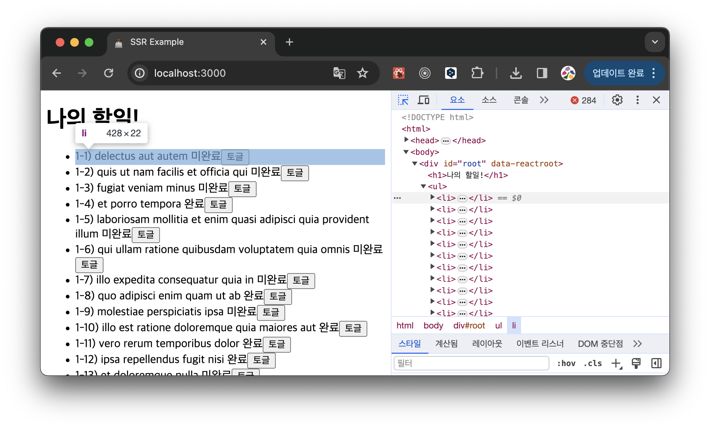

# React Server API를 활용하여 SSR 구현해 보기

# Server \***\*React DOM APIs\*\***

리액트는 서버 사이드 렌더링을 위한 서버 API를 제공합니다.

이 API들은 브라우저의 window 환경이 아닌 **Node.js와 같은 서버 환경**에서만 실행할 수 있고, 서버 API를 사용하면 서버에서 리액트 컴포넌트를 HTML로 렌더링할 수 있어 **빠른 초기 렌더링**이 가능하다는 장점이 있는데요.

몇 가지 기본적인 API를 간단하게 살펴보겠습니다.

- `renderToString`
  - 인수로 받은 컴포넌트를 렌더링해 HTML 문자열로 반환하는 함수입니다.
  - 이때, 이벤트 핸들러와 같이 클라이언트에서 실행되는 자바스크립트 코드는 포함되지 않으며 페이지의 단순 HTML 구조만 렌더링됩니다.
- `renderToStaticMarkup`
  - 인수로 받은 컴포넌트를 렌더링해 HTML 문자열로 반환하는 함수입니다.
  - `renderToString`과 비슷하지만, **리액트에서만 사용하는 추가적인 DOM 속성을 렌더링하지 않아** 렌더링 결과물인 HTML의 크기를 조금이나마 줄일 수 있습니다.
  - 이 함수를 통해 렌더링하면 리액트에서 제공하는 **브라우저 API(ex. useEffect)를 절대로 실행할 수 없습니다**. 즉, 사용자와의 상호작용 같이 브라우저 액션이 필요하지 않은 정적인 내용을 렌더링할 때 사용합니다.
- `renderToNodeStream`
  - Node.js 환경에 의존하는 API로, 렌더링 결과물을 Node.js의 `ReadableStream`으로 제공합니다.
  > `스트림(stream)`이란 큰 데이터를 다룰 때, 데이터를 청크(chunk, 작은 단위)로 분할해 조금씩 가져오는 방식을 의미합니다.
  - `renderToString`과 비슷하지만, HTML을 한 번에 렌더링하지 않고 여러 청크(chunk)로 분할해 조금씩 순차적으로 처리합니다.
  - 대부분의 리액트 SSR 프레임워크는 `renderToNodeStream`을 채택하고 있습니다.
- `renderToStaticNodeStream`
  - 리액트 자바스크립트에 필요한 리액트 속성을 제공하지 않으면서, HTML을 한 번에 렌더링하지 않고 여러 청크로 분할해 조금씩 순차적으로 처리합니다.
  - `renderToStaticMarkup`과 `renderToNodeStream`을 합친 느낌입니다.
- `hydrate`
  - `renderToString`과 `renderToNodeStream`으로 생성된 HTML 콘텐츠에 자바스크립트 핸들러나 이벤트를 붙이는 역할을 합니다.
  - 이미 렌더링된 HTML이 있다는 가정하에 작업이 수행됩니다.
    - 렌더링된 HTML이 없는 경우 경고 문구가 출력되지만, 렌더링을 한 번 수행하면서 hydrate가 수행한 렌더링 결과물 HTML과 인수로 넘겨받은 HTML을 비교하는 작업을 수행하기 때문에 정상적으로 웹페이지를 만들게 됩니다.
    - 단, 이렇게 렌더링을 한다면 서버와 클라이언트에서 두 번 렌더링을 하게 되어 SSR의 장점을 포기하는 것이 됩니다.
  - react18에서 **deprecated** 되었습니다.

# SSR 구현해 보기

Server API의 동작을 학습하기 위해 위 함수들을 사용하여 간단한 리액트 SSR 애플리케이션을 작성해 보겠습니다.

다음 예제는 *모던 리액트 Deep Dive (김용찬 저)*에서 제공하는 예제로, todo 목록을 받아와서 각 할 일을 클릭하면 useState로 완료 여부를 변경할 수 있는 간단한 애플리케이션입니다.

(리액트17 버전을 사용합니다.)

## 코드

### index.ts

서버로부터 받은 HTML을 `hydrate`를 통해 상호작용 가능한 웹 애플리케이션으로 만드는 역할을 합니다.

```tsx
import React from 'react';
import { hydrate } from 'react-dom';

import App from './components/App';
import { fetchTodo } from './fetch';

async function main() {
  const result = await fetchTodo();

  const app = <App todos={result} />;
  const el = document.getElementById('root');

  hydrate(app, el);
}

main();
```

`hydrate`는 서버에서 완성한 HTML과 하이드레이션 대상이 되는 HTML의 결과물(app)이 동일한지 비교하는 작업을 합니다. 이 비교 작업을 수행하기 위해 fetch가 필요합니다.

### App.tsx

todos를 props로 받아 렌더링합니다. 이때 todos는 **서버에서 요청**한 todos입니다.

```tsx
import React, { useEffect } from 'react';

import { TodoResponse } from '../fetch';

import { Todo } from './Todo';

export default function App({ todos }: { todos: Array<TodoResponse> }) {
  useEffect(() => {
    console.log('하이!'); // eslint-disable-line no-console
  }, []);

  return (
    <>
      <h1>나의 할일!</h1>
      <ul>
        {todos.map((todo, index) => (
          <Todo key={index} todo={todo} />
        ))}
      </ul>
    </>
  );
}
```

### Todo.tsx

일반적으로 볼 수 있는 리액트 컴포넌트입니다. 할 일 완료 여부를 상태로 가지고 있습니다.

```tsx
import React, { useState } from 'react';

import { TodoResponse } from '../fetch';

export function Todo({ todo }: { todo: TodoResponse }) {
  const { title, completed, userId, id } = todo;
  const [finished, setFinished] = useState(completed);

  function handleClick() {
    setFinished((prev) => !prev);
  }

  return (
    <li>
      <span>
        {userId}-{id}) {title} {finished ? '완료' : '미완료'}
        <button onClick={handleClick}>토글</button>
      </span>
    </li>
  );
}
```

### index.html

SSR을 수행할 때 기본이 되는 HTML 템플릿입니다.

```tsx
<!DOCTYPE html>
<html>
  <head>
    <meta charset="utf-8" />
    <meta name="viewport" content="width=device-width, initial-scale=1.0" />
    <title>SSR Example</title>
  </head>
  <body>
    __placeholder__
    <script src="https://unpkg.com/react@17.0.2/umd/react.development.js"></script>
    <script src="https://unpkg.com/react-dom@17.0.2/umd/react-dom.development.js"></script>
    <script src="/browser.js"></script>
  </body>
</html>
```

`_ _placeholder_ _` 부분에 서버에서 리액트 컴포넌트를 기반으로 만든 HTML 코드가 삽입됩니다.

`browser` 파일은 클라이언트 리액트 애플리케이션 코드를 번들링했을 때 제공되는 리액트 자바스크립트 코드로, App.tsx/Todo.tsx/fetch 등의 자바스크립트 코드가 포함됩니다.

### server.ts

서버에서 동작하는 파일입니다. 사용자의 요청 주소에 따라 어떠한 리소스를 내려줄지 결정하는 역할을 합니다.

```tsx
import { createServer, IncomingMessage, ServerResponse } from 'http';
import { createReadStream } from 'fs';

import { renderToNodeStream, renderToString } from 'react-dom/server';
import { createElement } from 'react';

import html from '../public/index.html';
import indexFront from '../public/index-front.html';
import indexEnd from '../public/index-end.html';

import App from './components/App';
import { fetchTodo } from './fetch';

const PORT = process.env.PORT || 3000;

async function serverHandler(req: IncomingMessage, res: ServerResponse) {
  const { url } = req;

  switch (url) {
    case '/': {
      const result = await fetchTodo();

      const rootElement = createElement('div', { id: 'root' }, createElement(App, { todos: result }));
      const renderResult = renderToString(rootElement);

      const htmlResult = html.replace('__placeholder__', renderResult);

      res.setHeader('Content-Type', 'text/html');
      res.write(htmlResult);
      res.end();
      return;
    }

    case '/stream': {
      res.setHeader('Content-Type', 'text/html');
      res.write(indexFront);

      const result = await fetchTodo();
      const rootElement = createElement('div', { id: 'root' }, createElement(App, { todos: result }));

      const stream = renderToNodeStream(rootElement);
      stream.pipe(res, { end: false });
      stream.on('end', () => {
        res.write(indexEnd);
        res.end();
      });
      return;
    }

    case '/browser.js': {
      res.setHeader('Content-Type', 'application/javascript');
      createReadStream(`./dist/browser.js`).pipe(res);
      return;
    }

    case '/browser.js.map': {
      res.setHeader('Content-Type', 'application/javascript');
      createReadStream(`./dist/browser.js.map`).pipe(res);
      return;
    }

    default: {
      res.statusCode = 404;
      res.end('404 Not Found');
    }
  }
}

function main() {
  createServer(serverHandler).listen(PORT, () => {
    console.log(`Server has been started ${PORT}...`); // eslint-disable-line no-console
  });
}

main();
```

`/stream` 부분을 살펴보면, rootElement를 renderToNodeStream 함수를 통해 렌더링함으로써 전체 HTML을 한 번에 렌더링하는 것이 아닌 청크가 생성될 때마다 res에 기록되는 코드를 확인할 수 있습니다.

## 실행 결과

CSR로 만든 리액트 앱과 다르게 각 할 일 요소들이 html로 렌더링된 것을 확인할 수 있으며, 토글 버튼이 실행되는 것을 통해 하이드레이션도 잘 수행된 것을 확인할 수 있습니다.



## 생각해볼 점

위 코드에서는 fetch가 서버에서 한 번, 하이드레이션을 위해 클라이언트에서 한 번 이렇게 총 두 군데서 일어납니다.

따라서 **서버에서 fetch한 시점과 클라이언트에서 fetch한 시점의 데이터에 차이가 있을 수 있다**는 문제점이 있는데요.

위 코드에서는 SSR의 작동 방식에 초점이 맞춰진 코드라 해당 부분 관련 처리가 생략되었으며, 실제 SSR 프레임워크의 경우 위 예제처럼 중복된 API 호출이 발생하지 않도록 별도의 처리가 들어간다고 합니다.

# 마치며

이렇게 리액트는 서버 API를 통해 UX를 개선할 수 있는 방법을 제공합니다.

사용자에게 더 빠른 웹페이지 결과물을 제공할 수 있다는 장점이 있지만, 서버 관련 코드를 추가적으로 다뤄야하기 때문에 개발자에게 부담이 되며, 고려할 것이 많아 복잡하기 때문에 좋은 성능을 보장하기에 어려움이 있습니다.

따라서 성능이 보장된 서버 사이드 렌더링을 수행하려면 Next.js와 같은 적절한 프레임워크 사용이 필요하다고 합니다.

이번엔 리액트 API가 어떤 식으로 작동하는 지 맛을 보는 데에 의의를 두겠습니다!

# Reference

모던 리액트 Deep Dive (김용찬 저)
