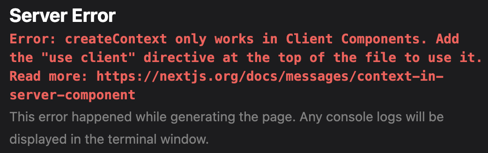
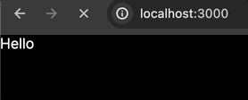
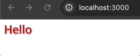

# Next.js에서 styled-components 사용하기

tags: next, styled-components
subtitle: Next.js에서 css-in-js를 사용하기 위한 설정

# 평소처럼 styled-components를 사용했는데..

Next.js(v14)에서 아무런 설정 없이 styled-components를 사용하면 다음과 같은 에러를 만날 수 있습니다.



## 위 에러가 발생한 이유

이는 styled-components가 SSR 페이지에서 동작하는 방식 때문입니다.

styled-components의 공식 문서를 살펴보면 다음과 같이 **컴포넌트가 서버에서 렌더링될 때, contextAPI를 통해 스타일을 적용한다**는 것을 알 수 있습니다.

> styled-components supports concurrent server side rendering, with stylesheet rehydration. The basic idea is that everytime you render your app on the server, you can create a `ServerStyleSheet` and add a provider to your React tree, that accepts styles via a context API.

결론적으로 styled-components로 스타일이 작성된 컴포넌트는 contextAPI를 사용해야 하기 때문에 클라이언트 컴포넌트가 돼야 하지만,

Next.js(v14)에서 `‘use client’` 키워드를 사용하지 않으면 서버 컴포넌트가 되어 버리기 때문에 위와 같은 에러가 발생하게 됩니다.

# 또 다른 문제의 발생

자 그럼, `‘use client’` 키워드를 추가해 보겠습니다.

키워드를 추가함으로써 해당 컴포넌트는 클라이언트 컴포넌트가 되었고 에러는 제거 되었지만, **스타일이 적용되지 않은 HTML이 잠깐 노출되는 현상**이 발생합니다.



## FOUC(Flash of Unstyled Content)

이러한 FOUC(현상을 스타일이 없는 콘텐츠의 플래시)라고 합니다.

위 현상이 발생하는 이유는 styled-components는 css-in-js기 때문입니다.

HTML 마크업으로 DOM을 구성한 다음에야 자바스크립트가 동작하기 때문에(hydrate) 자바스크립트로 작성된 css가 뒤늦게 적용되는 것이죠.

# 그럼 styled-components 못 쓰나요?

공식 문서에 나와있듯 styled-components는 SSR을 지원하기 때문에 별도의 설정을 추가해 준다면 사용할 수 있습니다.

# Next.js에서 styled-components 사용하기

> Next.js 14버전의 App router 방식입니다.

css-in-js 스타일을 서버에서 미리 모은 다음, 서버 사이드 렌더링을 할 때 한꺼번에 제공하는 방식으로 styled-components를 사용할 수 있습니다.

먼저, `next.config.js` 파일을 수정해 줍니다. 다음처럼 styled-components를 enabled 시켜주세요.

```jsx
const nextConfig = {
  compiler: {
    styledComponents: true,
  },
};
```

그런 다음, styled-components API를 사용하여 렌더링 중에 생성된 css 스타일 규칙을 모두 수집하기 위한 글로벌 레지스트리 컴포넌트를 만듭니다.

`useServerInsertedHTML` 훅을 사용하여 레지스트리에서 수집된 스타일을 루트 레이아웃의 <head> HTML 태그에 삽입합니다.

`lib/registry.tsx` 파일을 만들어 다음 코드를 작성해 주세요.

```tsx
'use client';

import React, { useState } from 'react';
import { useServerInsertedHTML } from 'next/navigation';
import { ServerStyleSheet, StyleSheetManager } from 'styled-components';

export default function StyledComponentsRegistry({ children }: { children: React.ReactNode }) {
  // Only create stylesheet once with lazy initial state
  // x-ref: https://reactjs.org/docs/hooks-reference.html#lazy-initial-state
  const [styledComponentsStyleSheet] = useState(() => new ServerStyleSheet());

  useServerInsertedHTML(() => {
    const styles = styledComponentsStyleSheet.getStyleElement();
    styledComponentsStyleSheet.instance.clearTag();
    return <>{styles}</>;
  });

  if (typeof window !== 'undefined') return <>{children}</>;

  return <StyleSheetManager sheet={styledComponentsStyleSheet.instance}>{children}</StyleSheetManager>;
}
```

마지막으로, root layout의 children을 위 레지스트리 컴포넌트로 감싸줍니다.

```tsx
import StyledComponentsRegistry from './lib/registry';

export default function RootLayout({ children }: { children: React.ReactNode }) {
  return (
    <html>
      <body>
        <StyledComponentsRegistry>{children}</StyledComponentsRegistry>
      </body>
    </html>
  );
}
```

위 과정을 완료하면, FOUC 이슈 없이 스타일이 잘 적용되는 것을 확인할 수 있습니다.


