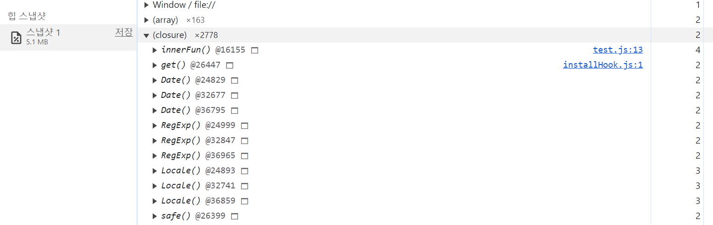
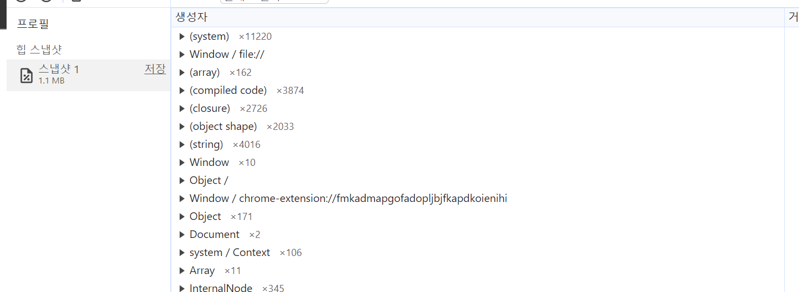

## Clouser

### 리엑트에서 클로저
React에서 클로저는 상태를 유지하고 부작용을 처리합니다. 특히 React의 hook 기능을 관리하기 위해 함께 사용되고 있습니다. 

이러한 클로저를 사용하는 훅은 다음과 같습니다. 

- `useState`: `useState`는 `state`를 추가하는 데 사용됩니다. 재렌더링 간에도 상태가 유지됩니다.
- `useEffect`: `useEffect`는 클로저를 통해 컴포넌트의  `state`와 `prop`에 액세스할 수 있습니다.
- `useContext`: 클로저를 사용하여 컨텍스트 값에 대한 액세스를 제공합니다.
- `useReducer`: 리듀서 함수는 클로저를 사용하여 현재 `state`와 작업에 액세스하는 경우가 많습니다.
- `useCallback`: useCallback은 메모리된 콜백 함수를 반환합니다. 이때 반환하는 메모리 함수를 클로저 형태로 저장합니다. 
- `useMemo`: `useCallback과` 유사하지만 **계산된 값을 메모하는 데 사용**됩니다. useMemo에 전달된 함수는 클로저를 사용하여 구성 요소 범위에서 값을 캡처할 수 있습니다.

state 값의 저장, 의존성 배열의 값 변경추적, prop 값 변경 추적에 클로저를 활용하고 있다는 것을 알 수 있습니다. 

### 클로저의 유의점
- 높은 메모리 비용, 클로저로 값을 저장하는 경우와 그렇지 않은 경우 메모리 차이가 크다는 것을 확인할 수 있습니다. 
```js
const $buttonClouser = document.querySelector('#clouser');

function outerFun() {
  const array = new Array(1000000).fill(0);
  return function innerFun() {
    console.log(array.length);
  };
}

$buttonClouser.addEventListener('click', innerFun);
```


```js
const $buttonNonClouser = document.querySelector('#non-clouser');

function heavyJob() {
  const longer = new Array(1000000).fill(0);
  console.log(longer.length);
}

$buttonNonClouser.addEventListener('click', heavyJob);

```



### 클로저를 활용한 `useEffect`의 조건 경합 방지

- `useEffect`를 활용한 데이터 fetch시에 조건 경합을 막기 위해 `boolean` 변수를 활용하는 것 또한 클로저를 활용한 방식입니다. 

```js
 useEffect(() => {
    let ignore = false;
    setBio(null);
    fetchBio(person).then(result => {
      if (!ignore) {
        setBio(result);
      }
    });
    return () => {
      ignore = true;
    }
  }, [person]);
```