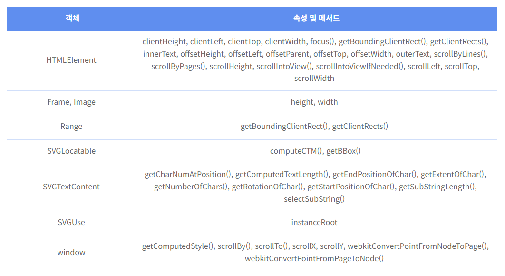
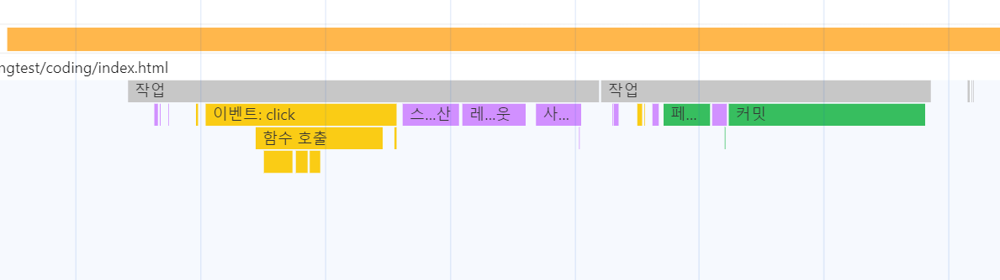
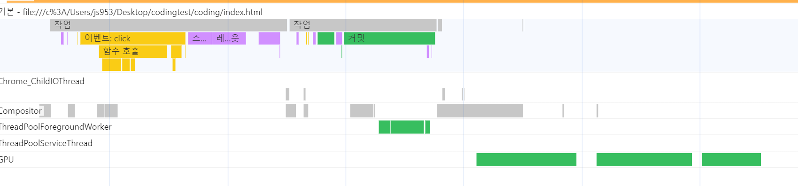
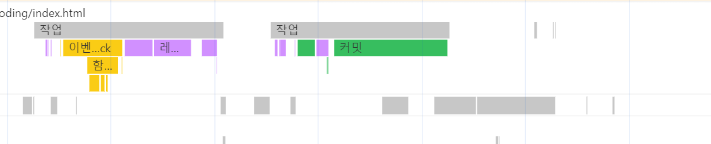
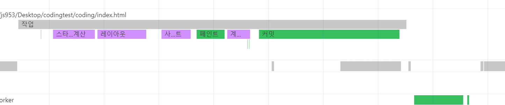
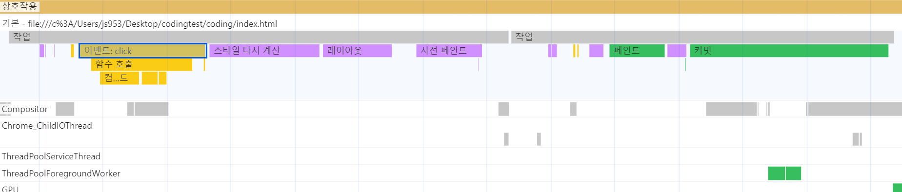

## DOM tree


1. 브라우저가 HTML 파일을 다운로드 
2. HTML을 파싱해 DOM 트리를 생성
3. CSS 파일을 만나면, CSS 파일을 다운로드 합니다.
4. CSS를 파싱해 CSS 노드로 구성된 트리(CSSOM)을 만듭니다. 이때 사용자 눈에 보이는 노드만을 방문합니다. `display: none;` 등의 요소가 있는 경우 방문하지 않습니다.
5. 눈에 보이는 노드를 대상으로 해당 노드에 일치하는 CSSOM 요소를 찾고 여기서 발견한 CSS 스타일 정보를 이 DOM 노드에 적용합니다. 이때 크게 두가지 과정으로 나뉩니다.
    - **레이 아웃(layout, reflow)** : 각 노드가 브라우저 화면의 어느 좌표에 정확히 나타나야 하는지 계산하는 과정, 이 레이아앗 과정을 거치면 반드시 페인팅 과정도 거치게 됩니다. 
    - **페인팅(painting)** : 레이 아웃 단계를 거친 노드에 색과 같은 실제 유효한 모습을 그리는 과정입니다. **이는 배경색 변경 등의 단순한 스타일 변경과 같은 작업이 발생하는 경우입니다.**

### 레이아웃과 페인팅이 발생하게 되는 요소 
- **DOM 노드의 변경**: 추가, 제거 업데이트
- **DOM 노드의 노출 속성을 통한 변경**: display:none은 리플로와 리페인트를 발생시키지만 비슷한 속성인 visibility:hidden은 요소가 차지한 영역을 유지해 레이아웃에 영향을 주지 않으므로 리페인트만 발생시킵니다.
- **스크립트 애니메이션**: 애니메이션은 DOM 노드의 이동과 스타일 변경이 짧은 시간 내에 수차례 반복해 발생되는 작업입니다.- **스타일**: 새로운 스타일시트의 추가 등을 통한 스타일 정보 변경 또는 기존 스타일 규칙의 변경
- **사용자의 액션**: 브라우저 크기 변경, 글꼴 크기 변경 등

> #### 크롬에서 렌더링 처리는 세 가지 상태의 단계로 표현
> - **Recalculate Style**: 요소의 스타일값을 재계산하는 단계
> - **Layout**: 리플로가 발생한 단계
> - **Paint**: 변경된 요소를 화면에 표현하는 단계

렌더 트리의 변경으로 인한 리플로와 리페인트는 비용이 많이 듭니다. 브라우저는 내부적으로 비용을 줄이기 위해 이러한 작업을 지금 당장 실행하지 않거나 나중에 실행하도록 미루는 방법으로 최적화합니다. **관련 작업을 큐(queue)에 쌓고 일정 시간 또는 일정 수의 작업이 쌓인 이후에 배치로 관련 작업을 한 번에 처리해서 여러 번 발생할 수 있는 리플로를 한 번으로 줄입니다.**

하지만 요소의 특정 속성이나 메서드를 이용해 값을 요청하는 것만으로도 이 같은 브라우저의 최적화 실행을 중단시킬 수 있습니다.
다음은 브라우저의 리플로 최적화 실행을 중단하고 추가적인 리플로를 발생시키는 것으로 알려진 객체의 속성과 메서드입니다.





### 테스트 하기 
- 리플로우와 리페인트를 확인하기 위해서 개발자도구를 활용할 수 있습니다. 개발자 도구의 성능 탭을 통해 이를 확인할 수 있습니다.
- 혹은 개발자 도구의 렌더링을 통해 리페인트가 이루어지는 곳에 초록색을 칠해 확인할 수 있습니다.
- 개발자 도구의 성능을 녹화해서 언제 리플로우와 리페인트가 이루어지는지 확인할 수 있습니다. 

```html
<!DOCTYPE html>
<html lang="en">
  <head>
    <meta charset="UTF-8" />
    <meta name="viewport" content="width=device-width, initial-scale=1.0" />
    <title>Document</title>
    <link rel="stylesheet" href="style.css">
  </head>
  <body>
    <article class="flex">
      <div class="div-1 div">1</div>
      <div class="div-2 div">2</div>
      <div class="div-3 div">3</div>
    </article>
    <button id="javscript-addElement">javscript-addElement</button>
    <button id="javscript-change-div1-bg">change div-1 bg</button>
    <button id="javscript-div2-animation">add css animation div-2</button>
    <button id="javscript-display-none">Make div-3 display none</button>
    <script src="./index.js"></script>
  </body>
</html>
```
```css

body {
  padding: 80px;
  font-family: 'NanumSquareRound',sans-serif;
  color: #555;
  display: flex;
  flex-direction: column;
  justify-content: center;
  align-items: center;
}

.div {
  width: 200px;
  padding: 10px;
  margin-bottom: 10px;
  background-color: black;
  color: white;
  display: flex;
  justify-content: center;
}

.none{
  display: none;
}

.animation{
  animation-name: slidein;
  animation-duration: 3s;
}

@keyframes slidein {
  from {
    margin-left: 100%;
    width: 300%;
  }

  to {
    margin-left: 0%;
    width: 100%;
  }
}
```
```js
class AddElement {
  #btn;

  constructor(id, name) {
    this.#btn = document.querySelector(`#${id}`);
    this.#btn.addEventListener('click', () => {
      const fn = this.addEvent(name);
      fn();
    });
  }

  /**
   *
   * @param {"animation" | "none" | "bg" | "add"} name
   * @returns
   */
  addEvent(name) {
    if (name === 'animation') {
      return this.addAnimation;
    }
    if (name === 'none') {
      return this.displayNone;
    }
    if (name === 'bg') {
      return this.changeBg;
    }
    if (name === 'add') {
      return this.addElement;
    }
  }

  addElement() {
    const div = document.createElement('div');
    const article = document.querySelector('.flex');
    div.innerText = 'Make new Div';
    div.classList.add('div');
    article.appendChild(div);
  }

  changeBg() {
    const div1 = document.querySelector('.div-1');
    div1.style.backgroundColor = 'red';
  }

  displayNone() {
    const div2 = document.querySelector('.div-2');
    div2.classList.add('none');
  }

  addAnimation() {
    const div3 = document.querySelector('.div-3');
    div3.classList.add('animation');
  }
}

const elementBtn = new AddElement('javscript-addElement', 'add');
const noneBtn = new AddElement('javscript-display-none', 'none');
const animationBtn = new AddElement('javscript-div2-animation', 'animation');
const bgBtn = new AddElement('javscript-change-div1-bg', 'bg');
```
##### element 추가하기
클릭 이벤트가 감지가 되고 리플로우와 리페인트가 다시 발생하는 것을 확인할 수 있습니다. 



##### bg 색 변경
클릭 이벤트가 감지가 되고 리플로우와 리페인트가 다시 발생하는 것을 확인할 수 있습니다. 


##### 에니메이션
클릭 이벤트가 감지가 되고 리플로우와 리페인트가 다시 발생하는 것을 확인할 수 있습니다. 
이때 element 요소가 지속적으로 변경되기 때문에 일정 주기로 지속적으로 리플로우와 리페인트가 발생하는 것을 확인할 수 있습니다.







##### none
css 요소에 `display:none;`을 추가할때도 리플로우와 리페인트가 발생합니다. 



## 리플로 최소화 방법

1. **작업 그루핑**
DOM 요소의 정보를 요청하고변경하는 코드는 같은 형태의 작업끼리 그룹으로 묶어 실행시키는 것이 좋습니다. 

```js
function change() {
    const width = document.getElementById("layer1").style.width;
    document.getElementById("layer2").style.width = width;
    const height = document.getElementById("layer3").style.height;
    document.getElementById("layer4").style.height = height;
}
```
위의 코드는 요소의 스타일 정보를 가지고 오고 이를 다른 element에 적용합니다. 이러한 과정이 순차적으로 반복됩니다. 이때 리플로우가 여러번 발생하게 됩니다. 이를 수정하기 위해 유사한 역할을 하는 것끼리 실행순서를 변경시키면 렌더링 처리를 향상시킬 수 있습니다. 


```js
function change() {
    const width = document.getElementById("layer1").style.width;
    const height = document.getElementById("layer3").style.height;
    document.getElementById("layer2").style.width = width;
    document.getElementById("layer4").style.height = height;
}
```

2. **실행 사이클**
리플로와 리페인트가 일어날 수 있는 작업은 가능하면 실행 사이클 안에서 실행하도록 처리하는 편이 효과적입니다.
즉 태스크 큐, 마이크로 테스크큐에서 리플로우와 리페인트가 발생하는 요소를 최소화 해야 합니다. 


3. **display 속성** 
`display:none`의 속성이 있는 경우 리플로우와 리페인트에서 제외됩니다. 이러한 특성을 활용해서 대규모의 style의 변경이 있을 경우, 우선 none 속성으로 해당 element의 리플로우를 발생시키고 모든 style이 변경된 후에 다시 리플로우를 진행해서 최종적으로 2번 만의 리플로우를 발생시켜 element를 변경할 수 있습니다.

```js
const element = document.getElementById("box1");
element.style.display = "none";

for(let i=50; i<100; i++) {
    element.style.width = i + "px";
}

for(let i=1; i<=50; i++) {
    element.style.borderWidth = i + "px";
}

element.style.display = "block";
```

4. **노드 복제**
변경하려는 요소의 노드를 복제한 후 복제된 노드에 필요한 작업을 실행하는 방법입니다. **복제된 노드는 DOM 트리에 추가된 상태가 아니므로 렌더링 성능에 영향을 줄 수 있는 작업을 실행하더라도 리플로나 리페인트가 발생하지 않습니다.**
```js
const element = document.getElementById("box1");
const clone = element.cloneNode(true);     // 원본 노드를 복제한다.

for(let i=0; i < 100; i++) {
    clone.style.width = i + "px";
}

// 변경된 복제 노드를 DOM 트리에 반영하기 위해 기존 노드와 치환한다.
parentNode.replaceChild(clone, element);
```

작업이 모두 완료된 이후 복제된 노드를 원래 노드와 치환해 DOM 트리에 변경된 사항이 적용되게 합니다. 그러면 치환 시점에만 리플로와 리페인트가 발생합니다.

5. **createDocumentFragment() 메서드 사용**
**메인 DOM 객체와는 별개의 새로운 DOM 객체를 생성해 사용하면 렌더링 성능을 좀 더 향상시킬 수 있습니다.**
