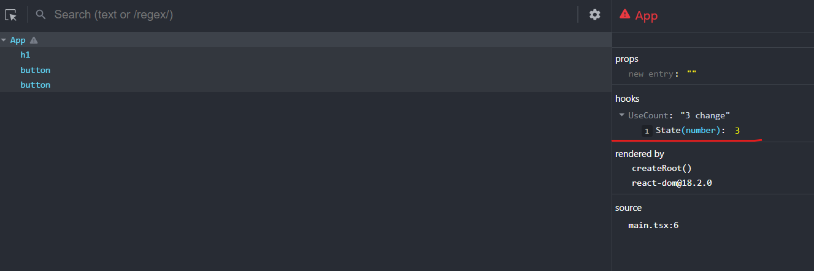

## useDebugValue

useDebugValue는 일반적으로 프로덕션 웹서비스에서 사용하지 않습니다. 해당 훅은 리엑트 애플리케이션 개발 과정에서 사용합니다. 특정 훅의 정보를 디버깅 하고 싶은 경우 사용하게 됩니다. 해당 훅은 컴포넌트 단위에서 사용하지 않습니다. **대게 custom hook에서 해당 훅에서 디버깅하고 싶은 정보를 관찰하기 위해 사용합니다.**
`useDebugValue(value, format?)`

### 사용 예시

```tsx
// value 만 전달할 경우
import { useDebugValue } from 'react';

function useOnlineStatus() {
  // ...
  useDebugValue(isOnline ? 'Online' : 'Offline');
  // ...
}
```

```tsx
// format 과 함께 사용하는 경우
useDebugValue(date, date => date.toDateString());
```
format 함수는 디버그 값을 매개변수로 받고 표시할 값을 문자열로 반환해야 합니다.


### 실제 활용 
```tsx
// useCount
import React from 'react';

export default function UseCount(): [
  number,
  { handlePlus: () => void; handleMinus: () => void },
] {
  const [number, setNumber] = React.useState(1);

  const handlePlus = () => {
    setNumber(prev => prev + 1);
  };
  const handleMinus = () => {
    setNumber(prev => (prev !== 0 ? prev - 1 : 0));
  };

  const fn = {
    handlePlus,
    handleMinus,
  };

  React.useDebugValue(number, number => `${number} change`);

  return [number, fn];
}
```

```tsx
import UseCount from '@/hook/useCount';

function App() {
  const [number, { handlePlus, handleMinus }] = UseCount();
  return (
    <>
      <h1>{number}</h1>
      <button onClick={handlePlus}>Plus</button>
      <button onClick={handleMinus}>Minus</button>
    </>
  );
}

export default App;
```
해당 훅에 사용된 useDebugValue 값의 변화를 다음과 같이 확인할 수 있습니다. 

