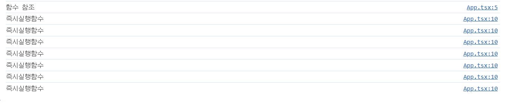

## useState
- useState는 배열을 반환합니다. 배열의 첫번째 인덱스 값은 useState의 초기 값입니다. 배열의 두 번째 인덱스 값은 해당 초기값을 변경하는 함수를 전달합니다. 만약 초기값을 전달하지 않았다면, state의 값은 `undefined`입니다.
```ts
import React from "react"

function App(){
    const [state, setState] = React.useState("initialValue")
}
```
- useState에서 관리하는 state를 사용하지 않고, 함수 내에서 변수를 통해서 상태값을 관리한다면, 어떠한 변화도 발생시키지 못합니다. 더불어 리렌더링의 trigger가 되는 setState를 통해 강제로 리렌더링을 발생시킨다고 해도 함수 내에서 직접 변수로 할당해 관리하는 상태값은 DOM tree에 반영되지 못합니다. 

```ts
import { useState } from 'react';

function App() {
  const title = 'hello';
  const [, setState] = useState<undefined | string>();

  const handleClick = () => {
    setState(title);
  };
  return (
    <>
      <h1>{title}</h1>
      <button onClick={handleClick}>제목 변경하기</button>
    </>
  );
}

export default App;

```
### UseState 구현해보기
state가 업데이트 되는 과정은 update가 필요한 함수 컴포넌트를 재실행하게 됩니다. 따라서 함수가 새롭게 실행되기 때문에 title은 리렌더링이 발생할때마다 `'hello'` 값을 새롭게 할당하게 됩니다. 그렇다면 useState에서 1차원의 얕은 비교를 수행하기 위해서 어떤 방법을 수행하는 것일까? 해당 방법을 수행하기 위해서 **useState는 내부적으로 클로저를 활용하고 있습니다**. 리엑트 환경에서 유사 `useState`를 만들었습니다. 이는 `render` 트리거를 구현하기 어려워 기존의 리엑트 render 트리거를 사용하기 위함입니다. 

```tsx
// core/MyReact.tsx
import App from '@/App';
import { root } from '@/main';

type CustomReact = {
  stateList: any[];
  currentIdx: number;
  useState: <T>(value: T) => [T, (value: T) => void];
};

const MyReact: CustomReact = {
  // 초기 값 지정
  stateList: [],
  currentIdx: 0,

  // useState 함수 설정
  useState: function <T>(initValue: T) {
    // useState가 새롭게 호출 될 때 마다 새로운 state 객체 생성
    if (this.currentIdx === this.stateList.length) {
      const state = {
        value: initValue,
        setState(newValue: T) {
          state.value = newValue;
          MyReact.currentIdx = 0;
          root.render(<App />);
        },
      };

      this.stateList.push(state);
    }

    const currentState = this.stateList[this.currentIdx];
    this.currentIdx++;

    return [currentState.value as T, currentState.setState];
  },
};

export default MyReact;
```

```tsx
// App.tsx
import MyReact from '@/core/MyReact';

function App() {
  const [number1, setNumber1] = MyReact.useState(1);
  const [number2, setNumbe2] = MyReact.useState(1);

  return (
    <>
      <div>number1 : {number1}</div>
      <div>number2 : {number2}</div>
      <button
        onClick={() => {
          setNumber1(number1 + 1);
        }}>
        number1 + 1
      </button>
      <button
        onClick={() => {
          setNumbe2(number2 + 1);
        }}>
        number2 + 1
      </button>
    </>
  );
}

export default App;
```

실행 방식은 다음과 같습니다.

1. `const [number1, setNumber1] = MyReact.useState(1);` 가 실행이 되면 MyReact 객체의 값은 다음과 같이 변경이 됩니다.
    ```
    currentIdx : 1
    stateList: [{state: 1, setState}]
    ```

2. `const [number2, setNumbe2] = MyReact.useState(1);`가 실행이 되면 MyReact 객체의 값은 다음과 같이 변경이 됩니다.
    ```
    currentIdx : 2
    stateList: [{state: 1, setState}, {1,setState}]
    ```

3. 버튼을 클릭해서 `setNumber1`이 실행이 됩니다. `setState` 내부의 코드는 다음과 같습니다. 
    ```tsx
    setState(newValue: T) {
        state.value = newValue;
        MyReact.currentIdx = 0;
        root.render(<App />);
    },
    ```
    우선 해당 객체의 state.value가 newValue로 교체가 됩니다. 이후 MyReact의 currentIdx가 0으로 초기화 됩니다. 이후 리렌더링이 발생합니다.

4. 리렌더링으로 인해 `App`이 재실행 됩니다. 따라서 `MyReact.useState`도 다시 한번 호출이 됩니다. `setState`로 인해 `MyReact.currentIdx`는 0으로 초기화가 되어 있습니다. 따라서 `MyReact.stateList.length`와 `MyReact.currentIdx`의 값은 다르기 때문에 새로운 state 객체가 배열에 추가되지 않습니다. 

5. `MyReact.useState`의 호출 순서대로 차례로 배열 인덱스에 맞추어 state 값들이 재 할당 됩니다. 이는 `MyReact.useState`의 호출 순서대로 다시 `MyReact.currentIdx` 값이 1씩 증가하기 때문에 순서가 유지가 되고, 다시 똑같은 state가 mapping 됩니다.

하지만 해당 방법은 lazy initialization, render 최적화 작업등이 이루어져 있지 않기에 추가적인 노력이 필요해보입니다..

## lazy initialization
`useState`에는 원시 값 뿐만 아니라 함수를 넣어주어서 함수의 반환값을 활용할 수 있습니다. 이때 함수를 넣는 것을 **lazy initialization**이라고 합니다. 
```tsx
import React from 'react';

function App() {
  const [number1, setNumber1] = React.useState(() => {
    console.log('함수 참조');
    return 1;
  }); //함수 전달 lazy initialization
  const [number2, setNumbe2] = React.useState(
    (() => {
      console.log('즉시실행함수');
      return 1;
    })(),
  ); // 즉시실행함수

  return (
    <>
      <div>number1 : {number1}</div>
      <div>number2 : {number2}</div>
      <button
        onClick={() => {
          setNumber1(number1 + 1);
        }}>
        number1 + 1
      </button>
      <button
        onClick={() => {
          setNumbe2(number2 + 1);
        }}>
        number2 + 1
      </button>
    </>
  );
}

export default App;
```
`useState`에 넘긴 함수는 초기 렌더링에 모두 실행이 됩니다. 이후 setState가 실행되어 리렌더링이 발생할 때마다 즉시실행함수로 값을 넘긴 경우 필요없는 호출이 반복되는 것을 확인할 수 있습니다. 

반면에 `lazy initialization`방법은 초기 렌더링에만 실행이 되고 이후 함수가 실행되지 않는 것을 확인할 수 있습니다.



이러한 `lazy initialization`은 초기값을 구할 때 무거운 연산이 필요한 경우 활용할 수 있습니다. 예를 들어 `map`, `filter`, `find` 등을 활용한 배열 탐색이 이에 해당할 수 있습니다.


## Batch
batch는 일괄 처리 입니다. react에서 배칭은 더 나은 성능을 위해서 여러개의 state 업데이트를 하나의 리렌더링으로 묶는 것을 의미합니다. 하나의 클릭 이벤트에 두 개의 state 업데이트를 가지고 있다면, React는 언제나 이 작업을 배칭해서 하나의 리렌더링으로 만듭니다. 
```tsx
function App() {
  const [count, setCount] = useState(0);
  const [flag, setFlag] = useState(false);

  function handleClick() {
    setCount((c) => c + 1); // 아직 리렌더링 하지 않는다
    setFlag((f) => !f); // 아직 리렌더링 하지 않는다
    // React는 이 함수가 끝나면 리렌더링을 한다 (이것이 배칭이다!)
  }

  return (
    <div>
      <button onClick={handleClick}>Next</button>
      <h1 style=>{count}</h1>
    </div>
  );
}
```
하지만 react는 데이터를 외부 소스로 부터 가져오는 로직에 관해서는 배칭하지 않고 독립적인 업데이트를 수행했습니다.
```tsx
    fetchSomething().then(() => {
      // React 17과 이전 버전에서는 이 업데이트들이
      // 이벤트가 *진행되는 중*이 아닌, *완료된 후의* 콜백에서 실행되기 때문에
      // 배칭되지 않았다.
      setCount((c) => c + 1); // 리렌더링을 발생시킨다.
      setFlag((f) => !f); // 리렌더링을 발생시킨다.
    });
```

react 18은 createRoot를 통해, 모든 업데이트들이 어디서 왔는가와 무관하게 자동으로 배칭합니다. 즉 이벤트 헨들러와 비동기 작업 내부에서 수행된 state 모두 일괄되게 배치 업데이트를 하게 됩니다. 

```tsx
  function handleClick() {
    fetchSomething().then(() => {
      // React 18과 이후 버전에서는 아래 항목들을 배칭한다.
      setCount((c) => c + 1);
      setFlag((f) => !f);
      // React는 이 콜백이 끝났을 때만 리렌더링을 하게 된다 (이제 여기도 배칭이 들어간다!)
    });
  }
```
react는 state를 배치 작업을 통해 일괄적으로 업데이트하기 때문에 다음과 같은 작업은 예상과 달리 작용하게 됩니다.
```tsx
  function handleClick() {
      setCount(number + 1);
      setCount(number + 1);
      setCount(number + 1);
      setCount(number + 1);
      setCount(number + 1);
      setCount(number + 1);
      // 결과는 number 값이 1일 때, 1이 됩니다. number는 이전 state 값이기 때문에 항상 1을 가리키게 됩니다. 
  }
```
위의 작업을 예상 대로 처리하기 위해서는 다음과 같이 변경하면 됩니다. 

```tsx
  function handleClick() {
    setCount((prev)=> prev + 1);
    setCount((prev)=> prev + 1);    
    setCount((prev)=> prev + 1);    
    setCount((prev)=> prev + 1);    
    setCount((prev)=> prev + 1);    
    // state가 이전의 변경된 값을 참조하기 때문에 호출한 횟수만큼 1을 더할 수 있습니다.
  }
```


## Reference
https://www.codementor.io/@lizraeli/implementing-the-usestate-hook-13o3wjkh3j