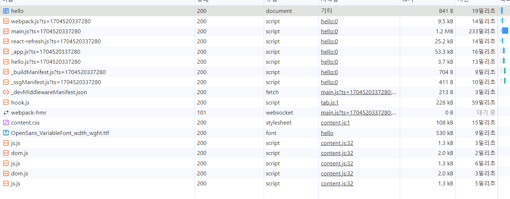
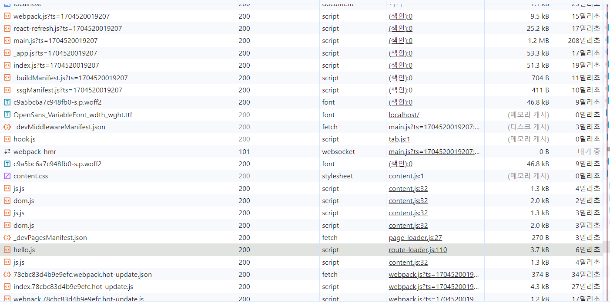

## Next.js 시작하기
해당 Next.js에 관한 설명은 v12, page router를 기준으로 설명을 합니다.

## next.config.js
Next.js 프로젝트의 환경 설정을 담당합니다. 

## PAGE
### pages/_app.tsx
Next.js를 초기화하는 파일로 Next.js 설정과 관련된 코드를 모아두는 곳입니다. 경우에 따라 서버와 클라이언트 모두에서 렌더링 될 수 있습니다. 
- 에러 바운더리를 사용해 애플리케이션 전역에서 발생하는 에러 처리
- reset.css 같은 전역 CSS 선언
- 모든 페이지에 공통으로 사용 또는 제공해야 하는 데이터 제공 
최초 렌더링 단계는 서버 사이드 렌더링으로 실행이 됩니다. 이후 클라이언트에서 _app.tsx의 렌더링이 실행된다는 것을 확인할 수 있습니다. 

### pages/_document.tsx
애플리케이션의 HTML을 초기화 합니다. 즉 Next.js로 만든 웹사이트의 뼈대가 되는 HTML 설정과 관련된 코드를 추가하는 곳입니다. 반드시 서버에서 렌더링 됩니다. 
- `html`이나 `body`에 DOM 속성을 추가하고 싶다면 `_document.tsx`를 사용합니다. 
- `_document.tsx`는 무조건 서버에서 실행됩니다. 따라서 이 파일에서 onClick과 같은 이벤트 핸들러를 추가하는 것은 불가능합니다. 이벤트를 추가하는 것은 클라이언트에서 실행되는 `hydrate`의 몫이기 때문입니다.
- Next.js에서는 두 가지 head가 존재합니다. 하나는 next/document에서 제공하는 head이고, 다른 하나는 next/head에서 기본적으로 제공하는 head입니다. 이름에서 알 수 있듯이 브라우저의 head와 동일한 역할을 하지만 **next/document는 오직 `_document.tsx`에서만 사용할 수 있습니다.** next/head는 페이지에서 사용할 수 있으며, SEO에 필요한 정보나 title등을 담을 수 있습니다. 
또한 next/document의 Head에는 title을 사용할 수 없습니다. 웹 애플리케이션에 공통적인 제목이 필요하면, _app.tsx에, 페이지 별 제목이 필요하면 페이지 내부 파일에서 사용합니다.
- _document.tsx에서 CSS-in-JS의 스타일을 서버에서 모아 HTML로 제공할 수 있습니다. 

### pages/_error.tsx
해당 page는 선택적으로 적용할 수 있으며, 반드시 필요하지는 않습니다. 해당 page는 클라이언트에서 발생하는 에러 또는 서버에서 발생하는 500 에러를 처리합니다. Next.js에서 발생하는 에러를 적절하게 처리하고 싶다면, 해당 페이지를 활용합니다. 개발 모드에서는 접근할 수 없으며, 프로덕션으로 빌드해서 확인을 해야 합니다. 

### pages/404.
404 페이지를 정의할 수 있는 파일입니다. 만들지 않는다면, Next.js에서 제공하는 기본 404페이지를 볼 수 있습니다. 

### pages/500.tsx
서버에서 발생하는 에러를 핸들링하는 페이지입니다. _error.tsx와 500.tsx가 모두 있다면, 500.tsx가 우선적으로 실행됩니다. 

### pages/index.tsx
해당 page는 개발자가 자유롭게 명칭을 지정해 만들 수 았는 페이지입니다. Next.js는 /pages 디렉토리를 기초로 구성되며, 각 페이지에 있는 default exprot로 내보낸 함수가 해당 페이지의 루트 컴포넌트가 됩니다. 

- /pages/index.tsx: 웹사이트의 루트이며, localhost:3000과 같은 루트 주소를 의미합니다.
- /pages/hello.tsx: localhost:3000/hello로 접근할 수 있습니다. 
- /pages/[gretting].tsx: []의 의미는 어떠한 문자도 올 수 있다는 것을 의미합니다. 예를 들어 localhost:3000/hello, localhost:3000/hi 모두 유효하게 접근이 되며, 해당 파일에서 이를 처리합니다. 그리고 변수에는 hello, hi 등의 정보가 담깁니다. 이때 이미 정의된 주소가 있다면(/pages/hello.ts) 이미 정의된 주소를 우선으로 합니다.
- /pages/[...hi].tsx: 자바스크립트의 전개 연산자와 같은 역할을 합니다. localhost:3000 하위의 모든 주소가 여기로 오게 됩니다. localhost:3000/hi/1, localhost:3000/hello/hi/2 등이 모두 해당 파일에서 처리합니다. 그리고 **[...hi] 값은 hi라는 변수에 배열로 오게 됩니다.**

## a tag와 Link 

Next.js는 서버사이드 렌더링과 클라이언트 사이드 렌더링을 모두 사용합니다. 이를 확인할 수 있는 방법이 a tag와 next/link에서 제공하는 Link 컴포넌트를 비교하는 것입니다. 
```tsx
import Head from 'next/head'

import { Inter } from 'next/font/google'
import styles from '@/styles/Home.module.css'
import Link from 'next/link'

const inter = Inter({ subsets: ['latin'] })

export default function Home() {
  return (
    <>
      <main className={`${styles.main} ${inter.className}`}>
        <a href='hello'>Go Hello with a</a>
        <Link href={'hello'}>Go Hello with Link</Link>
      </main>
    </>
  )
}
```
- a tag를 통해 localhost:3000/hello에 접근을 하면 서버사이드 렌더링과 같이 동작을 하게 됩니다. 
    
- Link 태그를 통해 접근을 하면, hello 접근에 필요한 자바스크립트 파일을 가지고와 클라이언트 사이드 렌더링 방식으로 동작하는 것을 확인할 수 있습니다. 
    

따라서 에플리케이션을 처음부터 서버에서 다시 불러와야 하는 경우가 아닌 경우, Link 태그와 router을 활용해서 페이지 이동을 구현합니다. 

## Data Fetching
Next.js에서 서버 사이드 렌더링을 지원하기 위한 데이터 불러오는 전략이 있습니다. 이는 Next.js에서 미리 지정해둔 name을 가진 함수를 호출함으로서 동작하게 됩니다. 즉 반드시 **정해진 함수명으로 export를 사용해 함수를 파일 외부로 내보내야 합니다.** 이를 활용하면, 미리 서버에서 필요한 페이지를 만들어서 제공하거나, 서버에서 데이터를 조회해서 페이지를 만들어서 제공할 수 있습니다. 

### getStaticProps, getStaticPaths
두 메서는는 모두 CMS(Contents Mangement System)나 블로그, 게시판과 같이 사용자에게 모두 동일한 페이지를 보여줄 때 사용합니다. 두 메서드는 반드시 함께 있어야 사용할 수 있습니다. 

```tsx
import type {
  InferGetStaticPropsType,
  GetStaticProps,
  GetStaticPaths,
} from 'next'
 
type Repo = {
  name: string
  stargazers_count: number
}
 
export const getStaticPaths = (async () => {
  return {
    paths: [
      {
        params: {
          name: 'next.js',
        },
      }, // See the "paths" section below
    ],
    fallback: true, // false or "blocking"
  }
}) satisfies GetStaticPaths
 
export const getStaticProps = (async (context) => {
  const res = await fetch('https://api.github.com/repos/vercel/next.js')
  const repo = await res.json()
  return { props: { repo } }
}) satisfies GetStaticProps<{
  repo: Repo
}>
 
export default function Page({
  repo,
}: InferGetStaticPropsType<typeof getStaticProps>) {
  return repo.stargazers_count
}
```
getStaticPaths는 pages/repo/[name]가 접근 가능한 주소를 정의하는 함수입니다. paths를 배열로 반환하는 것을 확인할 수 있습니다. params를 키로 하는 함수에 적절한 값을 배열로 넘겨주먼, 해당 페이지에서 접근 가능한 페이지를 정의할 수 있습니다. 해당 페이지는 next.js만 접근 가능함을 의미합니다. 

getStaticProps는 앞에서 정의한 페이지를 기준으로 해당 페이지로 요청이 왔을 때 제공할 props를 반환하는 함수입니다. 

마지막으로 page는 앞서 getStaticProps가 반환한 {repo} 를 렌더링하는 역할을 합니다. 이를 통해 빌드 시점에 미리 데이터를 불러온 다음 정적인 HTML 페이지를 만들 수 있습니다. 

getStaticPaths 의 옵션인 fallback은 빌드할 페이지가 너무 많은 경우 사용할 수 있습니다. paths에 미리 빌드할 몇 개의 페이지만 list로 반환하고 true나 "blocking"으로 값을 선언할 수 있습니다. 이를 통해 next build를 실행할 때 미리 반환한 paths에 기재돼 있는 페이지만 미리 빌드할 수 있습니다.
- true: 사용자가 미리 빌드하지 않은 페이지에 접근할 경우, 빌드되기 까지 fallback 컴포넌트를 보여줍니다. 
- "blocking": 별도의 로딩과 같은 처리를 하지 않습니다. 단순히 빌드가 완료될 때까지 사용자를 기다리게 하는 옵견입니다. 서버 사이드에서 렌더링 할 때까지 대기한 다음, 렌더링이 완료되면 해당 페이지를 제공합니다.

```tsx
export default function Page({
  repo,
}: InferGetStaticPropsType<typeof getStaticProps>) {
    const router = useRotuter();

    if(router.isFallback) return <div>Loading...</div>
    return repo.stargazers_count
}
```


### getServerSideProps
서버에서 실행되는 함수이며, 해당 함수가 있다면 무조건 페이지 진입 전에 이 함수를 실행합니다. 이 함수는 응답 값에 따라 페이지의 루트 컴포넌트에 props를 반환할 수도 혹은 다른 페이지로 리다이렉트 시킬 수 있습니다. 해당 함수가 있다면, **Next.js는 꼭 서버에서 실행해야 하는 페이지로 분류합니다. 빌드 시에도 서버용 자바스크립트 파일을 별도로 만듭니다.**  

Next.js의 서버사이드 렌더링의 과정은 다음과 같습니다. 
1. 서버에서 fetch 등으로 렌더링에 필요한 정보를 가져온다.
2. 1번에서 거져온 정보를 기반으로 HTML을 완성한다. 
3. 2번의 정보를 클라이언트(브라우저)에 제공한다.
4. 3번 정보를 바탕으로 클라이언트에서 hydrate 작업을 합니다. 이 작업은 DOM에 리엑트 라이프사이클과 이벤트 헨들러를 추가하는 작업입니다. 
5. 4번 작업인 hydrate로 만든 이렏트 컴포넌트 트리와 서버에서 만든 HTML이 다르다면, 불일치 애러를 발생시킵니다. (suppressHydrationWarning)
6. 5번 작업도 1번 작업과 마찬가지로 fetch등을 이용해 정보를 가지고 온다.

이때 **1번에서 가지고 온 정보와 6번에서 가지고 온 정보가 fetch로 인해 다를 수 있습니다.(side effect) 해당 문제를 해결하기 위해 1번에서 가지고 온 정보를 script형태로 HTML에 내려주는 것**입니다. 따라서 6번에서 재요청하는 것이 아닌 script를 읽어 1번 데이터와 동일한 정보를 가지고 오도록 합니다. 이를 Next.js는 window 객체에 저장합니다.

이떄 **script에 저장되는 정보는 JSON으로 제공이 됩니다. 따라서 JSON으로 직렬화 할 수 없는 값, class, Date 등은 props로 제공할 수 없습니다.** 

또한 getServerSideProps은 서버에서 실행되기에 다음과 같은 제약 사항이 있습니다. 
- window, document와 같이 브라우저에서만 접근할 수 있는 객체에 접근할 수 없습니다. 
- API 호출 시 반드시 완전한 주소를 제공해야 합니다. 서버는 자신의 호스트를 유추할 수 없기 때문입니다.
- 여기에서 에러가 발생한다면, 500.tsx와 같이 미리 정의한 에러 페이지로 리다이렉트 됩니다. 