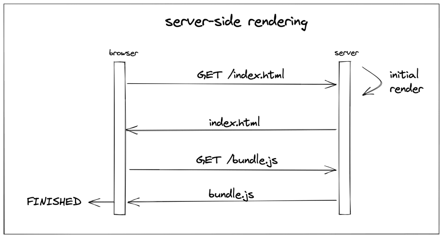

## Server-side Rendering
서버사이드 렌더링은 초기 HTML 문서를 서버에서 렌더링 하는 것을 의미합니다. 현재 react는 화면 상에 많은 인터렉션을 주어야 하기 때문에, 서버에서 정적인 페이지를 불러오지 않습니다. 페이지 로딩을 서버에게 위임하지 않고, 각 사용자의 CPU에게 전가합니다. 대부분의 SPA는 서버에서 JSON, XML 형식의 데이터를 클라이언트에 전달하고 해당 데이터에 따른 렌더링을 사용자의 브라우저에 위임합니다. 

따라서 SPA와 같은 구조는 하나의 html 파일(index.html)이 있고 연결된 자바스크립트에서 모든 DOM 노드 생성을 담당합니다. 

반면에 서버사이드 렌더링은 초기 렌더링을 server에서 진행합니다. 즉 React app의 초기 렌더링을 서버 측에서 처리하게 됩니다. 



이러한 SSR은 SEO, loading speed, social media previews(meta)에 유리합니다. 하지만 렌더링을 위한 별도의 서버를 두어야 하므로 서버 비용이 증가한다는 점을 기억해야 합니다.!! 또한 CSR보다는 고려해야 할점이 더욱 많습니다. 


## React에서 제공하는 Server-side Rendering

서버사이드 렌더링과 관련된 방법들은 모두 react-dom과 연관이 있습니다. react 코드를 어떻게 작성하느냐가 아닌, 이미 작성된 코드를 어떻게 렌더링 시킬지가 중요하기 때문입니다. client에서 렌더링을 할지, 서버에서 렌더링을 할지 결정해야 합니다. 

이를 위해서 react는 `react-dom/server`에서 관련 메서드를 정의하고 있습니다. 대표적인 메서드들로 `renderToString` , `renderToStaticMarkup`, `renderToNodeStream`, `renderToStaticNodeStream`, `hydrate`가 있습니다. 

### 1. `renderToString`
renderToString은 인수로 넘겨받은 리액트 컴포넌트를 렌더링해 HTML 문자열로 반환합니다. 서버사이드 구현에 필요한 가장 기초적인 API입니다. 
```tsx
import React from 'react';
import ReactDomServer from 'react-dom/server';
import App from '@/App';

export default function App() {
  const [number, setNumber] = React.useState(1);
  return (
    <div>
      <button
        onClick={() => {
          setNumber(prev => prev + 1);
        }}>
        plus
      </button>
      <span>{number}</span>
    </div>
  );
}


const result = ReactDomServer.renderToString(
  React.createElement('div', { id: 'root' }, <App />),
);
/* <div><div><button>plus</button><span>1</span></div></div> */
```
반환 값으로 완성된 DOM tree가 반환 되는 것을 확인할 수 있습니다. 이때 이벤트 헨들러는 연결되지 않았다는 것을 확인할 수 있습니다. 즉 renderToString은 빠르게 인수로 주어진 리엑트 컴포넌트를 기준으로 렌더링할 수 있돍 HTML을 제공하는 것에 목적이 있습니다. 

따라서 이벤트 헨들러, react의 hook은 서버에서 렌더링을 마친 이후로 별도로 자바스크립트 코드를 모두 다운로드 파싱, 실행하는 과정을 거쳐야 합니다. 

### 2. `renderToStaticMarkup`
`renderToString` 메서드와 유사합니다. 다만 **Static이란 단어에서 유추할 수 있듯이 non-interactive HTML을 반환**합니다. 
따라서 이벤트 헨들러나 훅으로 인한 interavtive가 없는 순수한 HTML을 반환합니다. 

### 3. `renderToNodeStream` && `renderToStaticNodeStream`
`renderToNodeStream`, `renderToStaticNodeStream`은 모두 클라이언트에서 실행이 불가능합니다. 왜냐하면, 두 메서드는 Node.js 환경에 의존하고 있기 때문입니다. 이름에서 유추 할 수 있듯, 두 메서드의 반환 형태는 ReadableStream입니다. utf-8로 인코딩된 바이트 스트림으로, Node.js 환경에서만 사용할 수 있습니다. 

stream은 데이터의 크기가 클 때 이를 작은 조각(chunk)으로 분할해 조금씩 가지고 오는 방법을 의미합니다. 즉 서버에서 렌더링해야 할 HTML의 크기가 클 경우 이를 한번에 처리하면, 많은 시간이 소요됩니다. 해당 문제를 해결하기 위해 `renderToNodeStream`을 활용해서 chunk 단위로 조금씩 응답을 완료하게 됩니다.

`renderToStaticNodeStream`은 non-interactive HTML을 chunk 단위로 렌더링하기 위해 사용하는 용도임을 확인할 수 있습니다. 
즉 반응형이 필요없는 순수 HTML 결과물이 필요할 때 사용합니다. 

### 4. `hydrate` 혹은 `hydrateRoot`

- **`hydrate`** 

`hydrate` 함수는(현재는 hydrateRoot로 대체 되고 있습니다. 다음 Major 버전에서 hydrate 함수는 삭제될 예정입니다.)
`hydrate`는 `ReactDOM.render`와 같은 역할을 합니다.
```tsx
hydrate(reactNode, domNode, callback?)
```

```tsx
import { hydrate } from 'react-dom';
const element = document.getElementById("root")
hydrate(<App/>, element)
```

`hydrate`는 기본적으로 이미 렌더링되어 있는 HTML이 있다는 가정하에 작업이 수행됩니다. 렌더링된 HTML을 기준으로 이벤트를 붙이는 작업만 실행합니다. 

만약 렌더링이 되어 있지 않은 빈 DOM 요소를 주게 된다면 `hydrate`는 에러를 생성하게 됩니다.
```tsx
// Warning: Expected server HTML to contain a matching <span> in <div>
```
미리 렌더링된 HTML 정보가 없을 시 위와 같은 에러가 발생합니다. 에러가 있더라도 리엑트는 정상적으로 웹페이지를 만듭니다. 하지만 이는 서버측에서 렌더링을 수행하고, 클라이언트 측에서 다시 렌더링을 실행함을 의미합니다. 즉 이벤트를 붙이는 작업 보다 더 많은 작업이 수행되기에 서버 사이드 렌더링의 장점을 포기하는 방법입니다. 

만약 `new Date()`와 같이 서버와 클라이언트 측에서 차이가 발생할 수 밖에 없는 결과가 있다면 , 해당 요소에 다음과 같이 처리할 수 있습니다. 
```tsx
<div suppressHydrationWarning>{new Date().toString()}</div>
```
하지만 위의 방법을 수행하는 것보다는 useEffect를 활용해서 클라이언트 측에서 해당 데이터를 생성하는 것이 더 옳은 방법일 수 있습니다. 

- **`hydrateRoot`**

`hydrateRoot`는 `hydrate`와 같은 역할을 합니다. `react-dom/server`를 통해 사전에 만들어진 HTML로 그려진 브라우저 DOM 노드 내부에 React 컴포넌트를 렌더링합니다.

`hydrateRoot`는 render와 unmount 메서드가 포함된 객체를 반환합니다. 

```tsx
const root = hydrateRoot(domNode, reactNode, options?)
```
```tsx
import { hydrateRoot } from 'react-dom/client';

const domNode = document.getElementById('root');
const root = hydrateRoot(domNode, reactNode);
```

## 서버 렌더링 적용하기 
Next.js 또한 express.js와 react로 만들어져 있습니다. 따라서 간단하게 SSR과 hydration을 적용하기 위해 서버는 express로 구성했습니다. 폴더 구조는 다음과 같습니다. 
```
📦react-ssr-test
 ┣ 📂client
 ┃ ┣ 📜App.jsx
 ┃ ┗ 📜index.js
 ┣ 📂public
 ┃ ┗ 📜index.html
 ┣ 📂server
 ┃ ┗ 📜server.jsx
 ┣ 📜package-lock.json
 ┗ 📜package.json
```

package.json에 설치한 라이브러리는 다음과 같습니다. 
```json
{
  "name": "react-server",
  "version": "1.0.0",
  "description": "test server with react",
  "main": "index.js",
  "scripts": {
    "build:client": "esbuild client/index.js --bundle --outfile=dist/bundle.js --loader:.js=jsx",
    "build:server": "esbuild server/server.jsx --bundle --outfile=build/server.js --platform=node",
    "build": "npm run build:client && npm run build:server",
    "start": "node ./build/server.js"
  },
  "author": "jun seok",
  "license": "ISC",
  "dependencies": {
    "esbuild": "0.14.13",
    "express": "^4.18.2",
    "nodemon": "1.18.4",
    "react": "^18.2.0",
    "react-dom": "^18.2.0"
  }
}
```

`client` 폴더에는 두 개의 파일이 있습니다. `App.jsx`, `index.js`입니다. 
```tsx
// index.js
import * as React from "react";
import { hydrateRoot } from 'react-dom/client';
import App from "./App";

hydrateRoot(document.getElementById("root"), <App /> );
```
```tsx
// App.jsx
import * as React from "react";

export default function App() {
  const [times, setTimes] = React.useState(0);
  return (
    <div>
      <h1>Hello {times}</h1>
      <button onClick={() => setTimes((times) => times + 1)}>ADD</button>
    </div>
  );
}
```
일반적인 SPA 방식과 차이가 없습니다. 차이점은 render 방식입니다. ReactDOM.render을 사용하지 않고 `hydrateRoot`를 통해 서버에서 받은 HTML 파일에 이벤트를 입히는 동작을 하고 있습니다. 

server 파일은 다음과 같습니다. 

```jsx
// server/server.jsx
import path from "path";
import fs from "fs";

import React from "react";
import ReactDOMServer from "react-dom/server";
import express from "express";

import App from "../client/App";

const PORT = process.env.PORT || 3000;
const app = express();

// build 과정을 통해 만들어진 폴더를 참조하기 위해 
// 상대 경로로 처리 ./../dist
app.use(express.static(path.join(__dirname,'..','dist')))

app.get("/", (req, res) => {
   // public 경로에 있는 index.html을 file system을 활용해서 읽어 드립니다. 
  fs.readFile(path.resolve("./public/index.html"), "utf8", (err, data) => {
    if (err) {
      console.error(err);
      return res.status(500).send("An error occurred");
    }

    return res.send(
      // public 경로에 있는 index.html에 ReactDOMServer의 renderToString 메서드를 통해 HTML로 반환후 이를 삽입합니다. 
      data.replace(
        '<div id="root"></div>',
        `<div id="root">${ReactDOMServer.renderToString(<App />)}</div>`
      )
    );
  });
});

app.use(
  express.static(path.resolve(__dirname, ".", "dist"), { maxAge: "30d" })
);

app.listen(PORT, () => {
  console.log(`Server is listening on port ${PORT}`);
});
```

## Reference

- 모던 리액트 Deep Dive
- https://dev.to/juhanakristian/basics-of-react-server-side-rendering-with-expressjs-phd
- https://react.dev/reference/react-dom/client/hydrateRoot