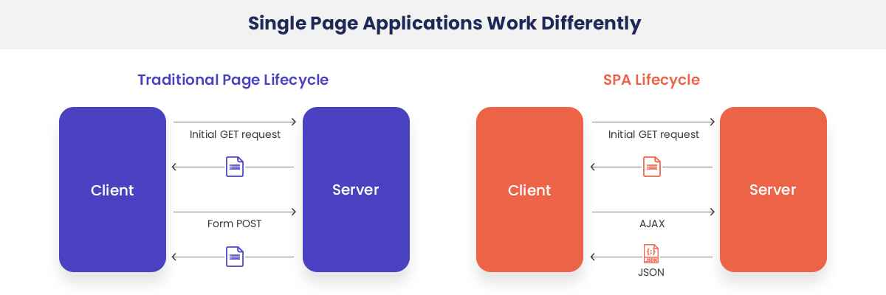

## 서버사이드 렌더링
react, angular, vue 등의 웹 프레임워크가 자바스크립트에서 대세가 된 이후, 웹 브라우저 환경에서 인기를 끈 방식은 SPA(Single Page Application)입니다. SPA의 장점은 화면 깜빡임 없이 사용자에게 부드러운 동작 기능을 제공할 수 있습니다. 해당 작업이 가능한 이유는, 사용자 CPU를 활용해서 자바스크립트에게 브라우저 UI, UX, 인터렉션 기능을 모두 맡기기 때문입니다. 이를 통해서 페이지 이동이 있을 시, 새로운 HTML을 서버에서 받아오는 것이 아닌, 서버에서 제공한 데이터를 자바스크립트에서 처리해서 일부 UI만을 새롭게 수정할 수 있습니다. 

이러한 SPA를 통해 많은 양의 리소스가 자바스크립트로 넘어오게 됩니다. 즉 자바스크립트의 코드 규모가 점차 커직게 됩니다. 이를 폭발적인 CPU, 인터넷 속도의 발전으로 대체할 수 있다고 믿었지만, 인터넷과 컴퓨터의 발전속도에 비례해 자바스크립트의 코드 규모도 함께 증가하게 됩니다. 따라서 본질적으로 사용자의 웹 페이지 로딩 속도는 오히려 더 느려지게 됩니다. 

서버 사이드 렌더링이 다시 각광 받게 된 이유는 이러한 SPA의 단점을 보완하기 위해서 이루어집니다. **서버 사이드 렌더링은 최초에 사용자에게 보여줄 페이지를 서버에서 렌더링해 빠르게 사용자에게 화면을 제공하는 방식을** 의미합니다.

이러한 **SPA와 SSR의 차이는 웹페이지 렌더링의 책임이 어디에 있느냐 입니다.** SPA는 사용자에게 제공되는 자바스크립트 번들에서 렌더링을 담당하지만, 서버 사이드 방식을 채택하면 렌더링에 필요한 작업을 모두 서버에서 수행합니다. 이는 SSR의 경우 사용자 기기의 영향을 받지 않고, 서버에 영향을 받게 됩니다. 다라서 비교적 안정적인 렌더링이 가능합니다.

## 서버 사이드 렌더링의 장점

1. **최초 페이지 진입이 비교적 빠르다(FCP - First Contentful Page)**
    
    일반적으로 서버에서 HTTP 요청을 수행하는 것이 더 빠르고, HTML을 그리는 작업도 서버에서 해당 HTML을 문자열로 미리 그려서 내려주는 것이 클라이언트에서 기존 HTML에 삽입하는 것보다 더 빠르기 때문입니다. 

    따라서 화면 렌더링이 HTTP 요청에 의존적이거나 렌더링해야 할 HTML의 크기가 커진다면 상대적으로 서버 사이드 렌더링이 더 빠를 수 있습니다. 

2. **검색 엔진과 SNS 공유 등 메타데이터 제공이 더 쉽습니다.**

    검색 엔진 로복이 사이트에서 필요한 정보를 가져가는 과정은 다음과 같습니다. 
    
    **(1) 검색 엔진 로봇이 페이지에 진입합니다.**

    **(2) 페이지가 HTML 정보를 제공해 로봇이 이 HTML을 다운로드 합니다. 단 다운로드만 하고 자바스크립트 코드는 실행하지 않습니다.** 

    **(3) 다운로드한 HTML 페이지 내부의 오픈 그래프(Open Graph)나 meta 태그 정보를 기반으로 페이지의 검색 정보를 가져오고 이를 바탕으로 검색 엔진에 저장합니다.**

    이때 엔진 로봇은 자바스크립트 코드를 실행하지 않습니다. 페이지의 정적 정보를 가지고 옵니다. 따라서 SPA와 같이 자바스크립트 코드가 실행되어야만 정보를 가지고 오는 앱에서는 적합하지 않다고 할 수 있습니다. 

3. **누적 레이아웃 이동이 적다**

    SSR은 누적 레이아웃 이동(Cumulative Layout Shuft)를 줄일 수 있습니다. 누적 레이아웃 이동은 사용자에게 페이지를 보여준 이후 뒤는게 HTML 정보가 추가되거나 삭제되어 마치 화면이 덜컥거리는 것과 같은 부정적인 경험을 제공하는 것을 말합니다. 

    SPA에서 HTTP 요청에 의존하는 경우, 각 API의 반응 속도는 제각각 입니다. 요청의 수, 서버의 환경에 따라 저희의 의도대로 동작하지 않습니다. 따라서 정적 페이지 정보를 제공한 후에 해당 UI가 이후에 추가로 업데이트 되어 누적 레이아웃이 발생합니다.

    SSR의 경우 해당 HTTP 요청을 서버에서 모두 완료해서 제공하기 때문에, 해당 문제를 해결할 수 있습니다. 하지만, 수 HTTP 요청이 서버 쪽에서도 많은 시간이 걸릴 경우, 해당 요청이 완료되기 까지 빈 페이지를 보여줄 수도 있습니다.

4. **사용자의 디바이스 성능에 비교적 자유롭다**

5. **보안에 좀 더 안전하다.**

    JAM(JavaScript, API, MarkUp) 스택을 활용한 SPA 방식은 보안에 취약합니다. 모든 활동이 브라우저에 노출되기 떄문입니다. 하지만 서버사이드의 경우 브라우저에 노출이 되지 않습니다. 

## 서버 사이드 렌더링의 단점

1. **소스 코드 작성시 서버를 고려해야 한다.**

    Node.js를 통해 서버의 소스 코들르 작성합니다. 이떄 Node.js는 window 객체, sessionStorage 등을 제공하지 않습니다. 따라서  window객체에 대한 접근을 최소화 해야 합니다. 또한 window 객체에 접근이 필요하다면, 서버 사이드에서 실행되지 않도록 처리해야 합니다. 

2. **적절한 서버가 구축돼 있어야 한다.**

    서버 사이드 렌더링은 사용자의 요청을 받아 렌더링을 수행할 서버가 필요합니다. 사용자의 요청에 따라 적절하게 대응할 수 있는 물리적인 가용량을 확보해야 하고 예기치 않은 장애 상황에 대응할 수 있는 복구 전략도 필요합니다. 

3. **서비스 지연에 따른 문제**

    서버 사이드에서 지연 문제가 발생한다면, SPA와 같이 특정 UI만을 `로딩 중`으로 처리할 수 없습니다. 해당 API 지연 문제가 해결 될 떄 까지 빈 화면을 보여주어야 합니다. 

## 현대의 서버 사이드 렌더링

요즘의 서버 사이드 렌더링은 싱글 페이지 어플리케이션의 장점을 흡수해서 기존의 서버 사이드 렌더링 방식과는 차이가 있습니다. 

**먼저 최초 웨사이트 진입 시에는 서버 사이드 렌더링 방식으로 서버에서 완성된 HTML을 제공받습니다. 이후 라우팅에서는 서버에서 내려 받은 자바스크립트를 바탕으로 마치 싱글 페이지 어플리케이션처럼 동작합니다.**