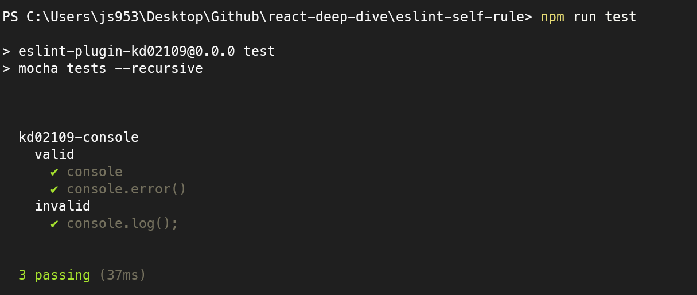

## ESLint를 활용한 정적 코드 분석

### ESLint 코드 분석 방법

ESLint는 자바스크립트 코드를 정적분석해 잠재적인 문제를 발견하고 나아가 수정까지 도와주는 도구다.. 그렇다면 ESLint는 어떻게 자바스크립트 코드를 읽어서 분석하는 것일까? 
1. 자바스크립트 코드를 문자열로 읽는다.
2. 자바스크립트 코드를 분석할수 있는 파서(parser)로 코드를 구조화한다.
3. 2번에서 구조화한 트리를 AST라 하며, 이 구조화된 트리를 기준으로 각종 규칙과 대조한다. 
4. 규칙과 대조했을 때 이를 위반한 코드를 알리거나(report) 수정한다(fix)

ESLint는 2번 과정 parser를 espree를 사용하여 진행합니다. 이러한 다양한 파서가 어떻게 자바스크립트, 타입스크립트 코드를 분석하는지 확인하고 싶다면, [AST explorer](https://astexplorer.net/)에서 확인할 수 있습니다.

이러한 팟는 단순히 변수, 함수, 함수명만을 파악하지 않습니다. 코드의 정확학 위치와 같은 아주 세세한 정보도 분석해서 알려줍니다. 이러한 정보가 있어야만 ESLint, Prettier 같은 도구가 코드의 줄바꿈, 들여쓰기 등을 파악할 수 있기 때문입니다.

타입스크립트 또한 `@typescript-eslint/typescript-estree`라고 하는 espree기반 파서가 있습니다. 이또한 위의 페이지에서 확인할 수 있습니다.

ESLint는 espree로 코드를 분석한 결과를 바탕으로 어떤 코드가 잘못되었고 수정이 필요한지 알려줍니다. 이를 규칙(rule)이라고 하면 이러한 rule을 모아둔 모음을 plugins라고 합니다.
---

### eslint-plugin, eslint-config

- **plugin**
    
    `eslint-plugin` 이라는 접두사로 지가하는 플러그인은 규칙의 모음입니다. 
    예를 들어 `eslint-plugin-import`는 자바스크립트에서 다른 모듈을 불러오는 import와 관련된 다양한 규칙을 제공합니다.

- **config**
    
    plugin이 특정 프레임워크나 도메인과 관련된 규칙을 묶어서 제공하는 패키지라면 `eslint-config`는 이러한 `eslint-plugin`을 한데 묶어서 완벽하게 한 세트로 제공하는 패키라고 할 수 있습니다. 

    - `eslint-config-airbnb`

        지금까지도 리액트 기반 프로젝트에서 config를 선택한다고 가정했을 때 가장 먼저 손에 꼽는 config입니다. `eslint-config-google`, `eslint-config-naver` 대비 압도적인 다운로드 수를 제공합니다. 
    
    - `@titicaca/triple-config-kit`

        `@titicaca/triple-config-kit`한국 커뮤니티에서 운영되는 config중 유지보수가 활발한 편에 속합니다. 대부분의 config가 `eslint-config-airbnb`를 바탕으로 수정해서 운영되는 것과는 달리 자체적으로 정의한 규칙을 기반으로 운영합니다. 
        
        또한 외부로 제공하는 규칙에 대한 테스트 코드가 존재합니다. 개발자가 규칙을 수정, 추가할 때 기대하는 바대로 triple-config에 규칙이 추가 되었는지확인할 수 있습니다.

        한국어퀀 커뮤니티에서 유지보수 되고 있는 eslint-config를 사용하고 싶거나 자체적인 confing 구축에 관심이 있다면 도움이 됩니다. 
    
    - `eslint-config-next`
        
        리엑트 기반 Next.js 프레임워크를 사용하고 있는 프로젝트에 사용할 수 있습니다. Next.js 11 버전부터 제공하고 있습니다. 

        단순히 자바스크립트 코드를 정적으로 분석 할 뿐만 아니라 페이지나 컴포넌트에서 반환하는 JSX 구문 및 _app, _document에서 작성돼 있는 HTML 코드 또한 정적 분석 대상으로 분류해 제공합니다.

        이는 전체적인 Next.js 기반 웹 서비스의 성능 향상에 도움이 될 수 있습니다. 또한 핵심 웹 지표(core web vitals)라고 하는 웹 서비스 성능에 영향을 미칠 수 있는 요소들을 분석해 제공하는 기능도 있습니다. 

---

## ESLint 규칙 만들어보기
특정 프로젝트에서 코드의 변화로 인해 일괄적으로 고쳐야 하는 코드가 있을 수 있습니다. 파일 내부에서 차ㅈ아서 수정하거나 pull request에서 리뷰로 코드를 수정하는 것도 좋지만, 일일이 확인해서 고치는 것은 비효율 적입니다. 이때 ESLint 규칙을 생성할 수 있습니다. 

### 이미 존재하는 규칙을 커스터마이징해서 적용하기 `import React`

리엑트 17버전부터 새로운 jsx 런타임 덕분에 `import React`구문이 필요 없어졌습니다. 따라서 `import React`를 삭제하게 되면 아주 약간이나마 번들러의 크기를 줄일 수 있게 되었습니다. 

`import React`에 대해 리포트 할 수 있는 ESLint 규칙을 만들려고 합니다. 이번에는 완전히 새로운 규칙을 만드는 대신 기존 규칙을 커스터마이징해서 해당 이슈를 감지하고자 합니다. 여기서 사용할 규칙은 [no-restircted-imports](https://eslint.org/docs/latest/rules/no-restricted-imports)입니다.

```js
module.exports = {
  root: true,
  env: { browser: true, es2020: true },
  extends: [
    'eslint:recommended',
    'plugin:@typescript-eslint/recommended',
    'plugin:react-hooks/recommended',
    "plugin:prettier/recommended",
  ],
  ignorePatterns: ['dist', '.eslintrc.cjs'],
  parser: '@typescript-eslint/parser',
  plugins: ['react-refresh','prettier',],
  rules: {
    'no-restricted-imports' : [
      'error',
      {
        // paths에 금지시킬 모듈을 추가합니다.
        paths:[
          {
            // 모듈명
            name: 'react',
            // 모듈의 이름
            importNames: ['default'],
            //경고 메시지
            message: "import React from 'react'는 react 17부터 더이상 필요하지 않습니다. 필요한 것만 react로부터 import해서 사용해 주세요"
          }
        ]
      }
    ]
  },
}
```
react 모듈 중에서 default export만 금지시킵니다. 이를 통해 import React만 올바르게 필터링 할 수 있습니다. 이를 `npm run lint`를 통해 살펴보면 아래와 같은 경고가 뜨는 것을 확인할 수 있습니다. 이러한 방법을 활용하면, import 방법을 강제해서 라이브러리를 사용하는 방법을 일관성 있게 적용할 수 있습니다. 


### 완전히 새로운 규칙 만들기 console.log()금지 시키기
개발 상에서는 유용하지만, 프로덕트에서는 console.log()코드가 존재해서는 안됩니다. 이미 eslint에서 
[no-console](https://eslint.org/docs/latest/rules/no-console#rule-details)이라는 규칙이 있지만, 새롭게 규칙을 만들어서 eslint를 이해해보고자 합니다. 

우선 console.log()를 espree로 변환한 JSON 파일을 확인합니다. 
```json
{
  "type": "Program",
  "start": 0,
  "end": 13,
  "range": [
    0,
    13
  ],
  "body": [
    {
      "type": "ExpressionStatement",
      "start": 0,
      "end": 13,
      "range": [
        0,
        13
      ],
      "expression": {
        "type": "CallExpression",
        "start": 0,
        "end": 13,
        "range": [
          0,
          13
        ],
        "callee": {
          "type": "MemberExpression",
          "start": 0,
          "end": 11,
          "range": [
            0,
            11
          ],
          "object": {
            "type": "Identifier",
            "start": 0,
            "end": 7,
            "range": [
              0,
              7
            ],
            "name": "console"
          },
          "property": {
            "type": "Identifier",
            "start": 8,
            "end": 11,
            "range": [
              8,
              11
            ],
            "name": "log"
          },
          "computed": false,
          "optional": false
        },
        "arguments": [],
        "optional": false
      }
    }
  ],
  "sourceType": "module"
}
```

- `ExpressionStatement`

    해당 코드의 표현식 전체를 의미합니다.
- `ExpressionStatement.expression`

    ExpressionStatement에 어떤 표현식이 들어가 있는지 확인합니다. 이는 Eslint에서 확인하는 하나의 노드 단위입니다. 
- `ExpressionStatement.expression.type`

    ExpressionStatement에 어떤 표현식이 들어가 있는지 확인합니다. 이는 Eslint에서 확인하는 하나의 노드 단위입니다. 
- `ExpressionStatement.expression.callee`

    해당 표현이 어떤 타입인지 나타냅니다. MemberExpression은 함수가 호출 되었음을 의미합니다. 또한 형태가 `object`이며 함수를 호출한 object의 이름은 console임을 알 수 있습니다.
    추가적으로 해당 console object에서 호출된 property 속성과 이름이 log임을 알려주고 있습니다. 


이를 참조해서 다음과 같이 console.log를 사용하지 못하도록 할 수 있습니다. 
```js
/**
 * @type {import('eslint').Rule.RuleModule}
 */

module.exports = {
    meta: {
        type: 'suggestion',
        docs: {
            description: 'disallow use console.log()',
            recommended: false,
        },
        fixable: 'code',
        schema: [],
        messages: {
            message: "console.log를 사용할 수 없습니다."
        },
    },
    create: function (context) {
        return {
            CallExpression: function(node){
                if(node.callee.object.name === 'console'&&node.callee.property.name === 'log'){
                    context.report({
                        node: node,
                        messageId: 'message',
                    })
                }
            }
        }
    }
}
```
meta 필드는 해당 규칙과 관련된 정보를 나타내는 필드입니다. 규칙과 관련된 정보를 제공하는 필드로 실제 규칙이 작동하는 코드와는 관련 없습니다. 여기서 사용가능 옵션은 [공식페이지](https://eslint.org/docs/latest/extend/custom-rule-tutorial)에서 확인할 수 있습니다.

create 필드는 함수를 작성합니다. 해당 함수는 객체를 반환해야 합니다. 여기서 코드 스멜을 감지할 선택자나 이벤트명을 선언할 수 있습니다. 함수 호출에 대해 감지해야 하기 때문에 `CallExpression`을 활용합니다. `CallExpression`을 찾았을 때, `node.callee.object.name === 'console' && node.callee.property.name === 'log'` 해당 노드에 다음과 같은 값이 있다면, context.report를 통해 해당 코드 스멜을 리포트하고 문제가 되는, node와 찾았을 때 노출하고 싶은 메시지를 가리키고 이를 노출하도록 합니다.


해당 코드의 test 코드를 다음과 같이 작성했습니다.
```js
/**
 * @fileoverview kd02109
 * @author kd02109
 */

'use strict'

// Requirements

const rule = require('../../../lib/rules/kd02109-console');
const RuleTester = require('eslint').RuleTester;


// Test

const ruleTester = new RuleTester();
ruleTester.run('kd02109-console', rule, {
    valid:[
        {
            code: "console"
        },
        {
            code: 'console.error()'
        }
    ],
    invalid:[
        {
            code: 'console.log();',
            errors: [{message: rule.meta.messages.message}]
        }
    ]
})
```


## 주의

- Prettier와 충돌

    Prettier는 코드의 포멧팅을 도와주는 도구입니다. ESLint와 동일하게 코드를 정적 분석해서 문제를 해결하는 점은 동일하지만 지향점이 다릅니다. **ESLint는 코드의 잠재적인 문제가 될 수 있는 부분을 분석합니다.** 반면 **Prettier는 포메팅과 관련된 작업, 즉 줄바꿈, 들여쓰기, 작은따옴표와 큰따옴표 등을 담당합니다.** Prettier는 자바스크립트에서만 동작하는 ESLint와 달리 JSON, css, HTML, 마크다운 등 다양한 언어세 적용할 수 있습니다.

    여기서 Prettier ESLint는 충돌을 일으킵니다. ESLint에서도 Prettier에서 처리하는 포메팅 작업을 처리할 수 있기 때문에 서로 충돌하는 규칙으로 에러가 발생합니다.

    1. Prettier에서 제공하는 규칙을 어기지 않도록, ESLint에서는 해당 규칙을 끄는 방법입니다.
    2. 자바스크립트, 타입스크립트에는 ESLint를 나머지 HTML, CSS, JSON에는 Prettier를 적용하는 방법입니다. 만약 자바스크립트에 추가적인 Prettier 규칙이 필요하다면, eslint-plugin-prettier를 사용합니다. 

    하지만 이제는 고민을 하지 않아도 될 것 같습니다. ESLint v8.53.0 버전 이후로는 포메팅에 관한 지원을 더이상 하지 않는다고 합니다. [관련 글](https://eslint.org/blog/2023/10/deprecating-formatting-rules/) 따라서 ESLint 버전에 맞게 잘 살펴보고 세팅을 해야 할 것 같습니다. 

- ESLint 버전 충돌

    사용하는 라이브러리의 esLint의 버전이 현재 설치한 버전과 일치하지 않고, 지원하는 플러그인의 종류가 다르다면 애러가 발생할 수 있습니다. 이러한 문제를 사전에 방지하기 위해서는 ESLint를 peerDependencies로 설정을 해야합니다. 

## 참조
- https://stackoverflow.com/questions/47972903/difference-between-callexpression-and-memberexpression
- https://eslint.org/docs/latest/extend/custom-rule-tutorial
- [peerDependencies](https://velog.io/@johnyworld/Peer-Dependencies-%EC%97%90-%EB%8C%80%ED%95%98%EC%97%AC)
- 모던 리액트 Deep Dive