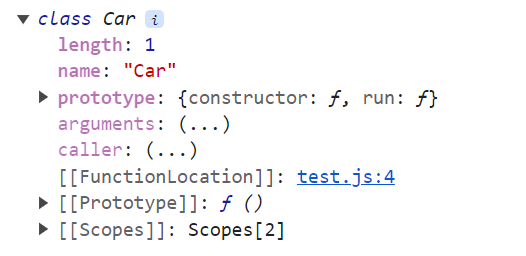

## 클래스 

### constrouctor
`constrouctor`는 생성자입니다. 객체를 사용하기 위해 사용하는 특수한 메서드입니다. 오직 단 하나만 존재할 수 있습니다. 
```js
//javascript
class Car {
  constructor(name) {
    this.model = name;
  }
}
```

```ts
// typeScript
class Car {
  constructor(public model: string) {}
}
```

### 인스턴스 메서드
- 인스턴스 메서드는 메서드 형식으로 작성해야합니다. 

```js
class Car {
  // 필드
  moving = () => {
    console.log('moving');
  };

  // 생성자 함수
  constructor(name) {
    this.model = name;
  }

  // 인스턴스 메서드
  run() {
    console.log(`${this.model} run`);
  }
}
```

- `getPrototypeOf`를 통해서 인수로 넘겨준 변수의 `prototype`을 확인할 수 있습니다. 아래 예시 코드를 통해 Car의 `prototype`을 받은 것을 확인할 수 있습니다. 
- 이때 화살표 함수로 선언된 필드는 인스턴스 메서드가 아닌 각 필드의 프로퍼티로 취급됩니다.
```js
const car = new Car('sonata');
console.log(Object.getPrototypeOf(car));
/*
{constructor: ƒ, run: ƒ}
*/

console.log(car);
/*
Car {model: 'sonata', moving: ƒ}
*/
```



### 정적 메서드
정적 메서드는 클래스의 인스턴스가 아닌 클래스의 이름으로 호출을 합니다. 
```js
class Car {
  constructor(name) {
    this.model = name;
  }

  run() {
    console.log(`${this.model} run`);
  }

  moving = () => {
    console.log('moving');
  };

  static PrintName() {
    console.log('CAR NAME');
  }
}

console.dir(Car);
```


해당 static 메서드 또한 상속해서 사용할 수 있습니다.

```js
class Car {
  static printName() {
    console.log('CAR NAME');
  }
}

class Sonata extends Car {
  constructor() {
    super();
    this.name = 'sonata';
  }
}
console.dir(Sonata);
Sonata.printName(); // CAR NAME
```


### 타입스크립트의 클래스 
자바스크립트 es6에서 등장한 클래스는 객체 인스턴스를 더욱 쉽게 생성하기 위한 문법기능(syntactic suger)입니다. 실제 동작은 함수와 같습니다.
이러한 클래스는 타입스크립트에서 값과 타입 공간 모두에 포함이 됩니다.
```ts
class Developer {
  name: string;
  domain: string;

  constructor(name: string, domain: string) {
    this.name = name;
    this.domain = domain;
  }
}

const developer: Developer = new Developer('jun', 'FE');
```
변수명 `developer` 뒤에 등장하는 `Developer`는 타입에 해당하지만 `new`키워드 뒤의 `Developer`는 클래스의 생성자 함수인 값으로 동작합니다.
타입스크립트에서 클래스는 타입 애너테이션으로 사용할 수 있지만 런타임에서 객체로 변환되어 자바스크립트의 값으로 사용되는 특징을 가집니다.

> <h3> 타입 애너테이션 (Annotation)</h3>
> 
>- Annotation은 `주석을 달다`라는 사전적인 뜻을 가지고 있습니다. 
>
> - 타입스크립트에서는 변수, 함수, 함수 반환값의 데이터 타입을 지정하기 위해 "타입 어노테이션"을 사용한다. 즉, 타입에 주석을 단다.
한 번 식별자를 특정 타입으로 annotated 하면 해당 타입만 사용할 수 있다.
다른 타입을 사용하게 되면 타입스크립트 컴파일러가 에러를 던진다.

```ts
class Car {
  constructor(public model: string) {}

  static hello() {
    console.log(`Hello Car`);
  }

  run() {
    console.log(`${this.model} run`);
  }
}

const car= new Car("sonata")
type NewCar = typeof Car // 생성자 함수 자체를 가리킵니다.
type CarModel = Car //new 생성자를 통해 생성한 인스턴스를 가리킵니다.
type key = keyof CarModel
const model:key = "model"
const value: CarModel[key] = "sonata"
```