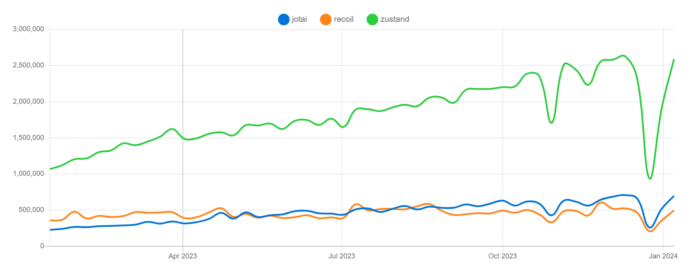
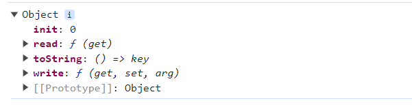

## trend of recoil, zustand and jotai



## Recoil

- react를 개발한 facebook에서 만든 라이브러리로 훅의 개념을 활용해서 상태 관리를 시작한 최초의 라이브러리 입니다.
- 2020년 처음 만들어 졌지만 아직 정식으로 출시한 버전이 아닙니다. 이러한 점 때문에 실제 프로덕션에 적용하는 것에 꺼리는 분위기가 많습니다.

### RecoilRoot
```tsx
import React from 'react';
import {
  RecoilRoot,
  atom,
  selector,
  useRecoilState,
  useRecoilValue,
} from 'recoil';

function App() {
  return (
    <RecoilRoot>
      <CharacterCounter />
    </RecoilRoot>
  );
}
```
`RecoilRoot`의 구조는 다음과 같이 정리할 수 있습니다. 

- Recoil의 상태값은 RecoilRoot로 생성된 Context의 스토어에 저장됩니다.
- 스토어의 상태값에 접근할 수 있는 함수들이 있으며, 이 함수를 활용해 상태값에 접근하거나 상태값을 변경할 수 있습니다. 
- 값의 변경이 발생하면 이를 참조하고 있는 하위 컴포넌트에 모두 알립니다. 

### atom
atom은 상태를 나타내는 recoil의 최소 상태 단위입니다. atom은 모든 컴포넌트에서 읽고 쓸 수 있습니다. atom의 값을 읽는 컴포넌트는 해당 atom에 암시적으로 구독되어 있으므로 atom이 업데이트되면 해당 atom에 구독된 모든 컴포넌트가 다시 렌더링됩니다. atom은 다음과 같은 구조로 선언할 수 있습니다. 
```tsx
const textState = atom({
  key: 'textState', // unique ID (with respect to other atoms/selectors)
  default: '', // default value (aka initial value)
});
```

이러한 atom 값을 가져오는 방법으로는 `useRecoilValue(state)`, `useRecoilState(state)` 이 대표적입니다. `useRecoilValue(state)`는 atom에 저장된 상태 값을 읽어오는 역할만을 한다면, `useRecoilState(state)`는 react의 useState와 동일하게, atom의 상태값, atom 상태를 setter하는 function을 배열 형태로 반환합니다. 

이러한 `useRecoilValue(state)`, `useRecoilState(state)`는 모두 현재 값과 이전 값을 비교해 해당 state의 값이 변경 되었다면, state를 참조하는 모든 컴포넌트에 리렌더링을 발생시킵니다. 

### selector
selector는 한 개 이상의 atom 값을 바탕으로 새로운 값을 조립할 수 있는 AI 입니다. 
```tsx
function selector<T>({
  key: string,

  get: ({
    get: GetRecoilValue,
    getCallback: GetCallback,
  }) => T | Promise<T> | Loadable<T> | WrappedValue<T> | RecoilValue<T>,

  set?: (
    {
      get: GetRecoilValue,
      set: SetRecoilState,
      reset: ResetRecoilState,
    },
    newValue: T | DefaultValue,
  ) => void,

  dangerouslyAllowMutability?: boolean,
  cachePolicy_UNSTABLE?: CachePolicy,
})
```

get은 객체 인자를 전달하는데, recoilValue 값을 readOnly로 읽어 올수 있습니다. 이를 통해서 반환 값을 조정해서 기존 state값을 활용하는 atom을 생성할 수 있습니다.

set은 활용 방법이 보다 다릅니다. 객체 인자의 set은 다음과 같은 방법으로 해당 atom state 값을 newValue로 최신화 합니다. 
```tsx
const transformSelector = selector({
  key: 'TransformSelector',
  get: ({get}) => get(myAtom) * 100,
  set: ({set}, newValue) =>
    set(myAtom, newValue instanceof DefaultValue ? newValue : newValue / 100),
});
```

## Jotai

Recoil의 atom 모델에 영감을 받아 만들어진 상태 관리 라이브러리입니다. 

Jotai는 상향식(bottom-up) 접근법을 취하고 있습니다. 이는 리덕스와 같이 하나의 큰 상태를 애플리케이션으로 내려주는 방식이 아닌, 작은 단위의 상태를 위로 전파할 수 있는 구조를 취하고 있음을 의미합니다.

### atom
recoil과 동일하게 atom 개념이 존재합니다. 즉 jotai에서도 atom은 recoil과 동일하게 최소 상태 단위를 의미합니다. 

recoil과 다른 점은 atom 하나만으로 상태를 만들 수도, 혹은 이에 파생된 상태를 만들 수도 있습니다. 
```tsx
import { atom } from 'jotai';

const numAtom = atom(0);

export default function App() {
  console.log(numAtom);
  return <div>App</div>;
}

```

이러한 atom의 반환 값은 객체로 내부에는 init 프로퍼티(초기 값), read(값 가지고 오기), write(값 설정) 메서드가 저장되어 있습니다. jotai는 atom 내부에 상태를 저장하고 있지 않습니다. jotai는 상태를 `useAtomValue`에 저장하고 있습니다.

이러한 `useAtomValue`는 내부에서 useReducer를 활용하고 있습니다. useReducer에서 3 가지의 상태 값을 반환합니다. `[version, valueFromReducer, atomFromReducer]`입니다. 첫 번째는 store의 버전, 두 번째는 atom에서 get을 수행했을 때 반환되는 값, 세 번째는 atom 그 자체를 의미합니다. 

recoil과는 다르게 컴포넌트 루트에서 Context가 존재하지 않아도 되는데, Context가 없다면, Provider가 없는 형태로 기본 스토어를 루트에 생성하고 이를 활용해 값을 저장하기 때문입니다.

reducer를 활용해서 store에 있는 atom의 값과 넘겨 받은 atom의 값이 달라진다면, 값의 최신화가 이루어집니다.

### 특징 
이러한 jotai는 Recoil에서 영감을 받았기에 recoil과 사용법이 유사합니다. 또한 recoil의 한계점을 극복하기 위해 노력했습니다. 
- atom 개념을 도입해서 API가 간결합니다. jotai는 각 atom의 키를 추상화해서 recoil 처럼 키를 관리할 필요가 없습니다. 
- recoil에서는 atom을 활용하여 파생된 값을 만들기 위해서 selector가 필요했지만, jotai는 selector 없이 atom 만으로 파생된 값을 만들 수 있습니다. 
    ```tsx
    import { atom, useAtom } from 'jotai';

    const textAtom = atom('readonly atoms')
    const uppercase = atom((get) => get(textAtom).toUpperCase())

    export default function Page() {
        const [lowercaseText, setLowercaseText] = useAtom(textAtom);
        const [uppercaseText] = useAtom(uppercase);
        const handleChange = (e) => setLowercaseText(e.target.value);
        return (
            <div className="app">
            <input value={lowercaseText} onChange={handleChange} />
            <h1>{uppercaseText}</h1>
            </div>
        )
    }
    ```
- 현재 jotai는 v2.x 버전까지 출시가 되어 있기 때문에 정식 버전입니다. 따라서 recoil보다는 실제 프로덕션에 사용하기 유리해 보입니다. 

## Zustand

zustand는 리덕스에 영향을 받고 만들어졌습니다. 따라서 zustand는 하나의 스토어를 중앙 집중형으로 활용해 스토어 내부에서 상태를 관리하고 있습니다. 

따라서 zustand를 이해하기 위해서는 하나의 큰 스토어가 어떻게 만들어지는 지 이해해야 합니다. 

이러한 store는 리엑트와는 별개로 작성되어 있습니다. 내부에서 리엑트 코드를 활용하고 있지 않습니다. 따라서 createStore는 바닐라 자바스크립트에서도 사용할 수 있습니다. 


### zustand의 리엑트 코드 
리엑트 코드는 zustand의 `src/react.ts에서 확인할 수 있습니다.` 스토어에 값을 저장하고 활용하는 기능들은 모두 vanilla.ts에서 가지고 와서 활용하는 것을 확인할 수 있습니다.
```tsx
import { createStore } from './vanilla.ts'
import type {
  Mutate,
  StateCreator,
  StoreApi,
  StoreMutatorIdentifier,
} from './vanilla.ts'
```

이러한 리엑트에서 사용하기 위해 타입을 제외하고 export 하는 함수는 `useStore`와 `create`입니다.

`create`를 활용하지 않고 `createStore`와 `useStore`를 활용해서 리엑트 외부에 store를 생성하고 활용할 수 도 있습니다. 
```tsx
import { createStore, useStore } from 'zustand';

const store = createStore<{ count: number }>(set => ({
  count: 1,
}));

export default function App() {
  const { count } = useStore(store);

  return <div>{count}</div>;
}

```
### 특징
- 빠르게 스토어를 사용할 수 있습니다. 코드 자체가 간결하고 사용하기 쉽습니다. 
- typescript 기반으로 작성되어 있어 타입스크립트를 자연스럽게 활용할 수 있습니다. 
- redux와 동일하게 middleware를 지원합니다. `create`의 두번째 인수로 원하는 미들웨어를 전달할 수 있습니다. 
