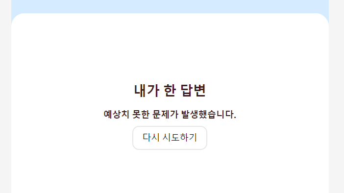

## 클래스형 컴포넌트의 getDerivedStateFromError 와 componentDidCatch

getDerivedStateFromError는 자식 컴포넌트에서 에럭 발생했을 때, 호출되는 에러 메서드입니다. 이 에러 메서드를 사용하면, 적절한 에러 처리 로직을 구현할 수 있습니다. 

componentDidCatch는 자식 컴포넌트에서 에러가 발생했을 때 실행이 됩니다. componentDidCatch는 두개의 인자를 받습니다. error와 어떤 컴포넌트가 에러를 발생시켰는지 정보를 가지고 있는 info입니다. 

### 사용 예제


```tsx
class ErrorBoundary extends React.Component {
  constructor(props) {
    super(props);
    this.state = { hasError: false };
  }

  static getDerivedStateFromError(error) {
    // Update state so the next render will show the fallback UI.
    return { hasError: true };
  }

  componentDidCatch(error, info) {
    // Example "componentStack":
    //   in ComponentThatThrows (created by App)
    //   in ErrorBoundary (created by App)
    //   in div (created by App)
    //   in App
    logErrorToMyService(error, info.componentStack);
  }

  render() {
    if (this.state.hasError) {
      // You can render any custom fallback UI
      return this.props.fallback;
    }

    return this.props.children;
  }
}
```
```jsx
// 실제 사용예시
<ErrorBoundary fallback={<p>Something went wrong</p>}>
  <Profile />
</ErrorBoundary>
```

해당 클래스형 컴포넌트를 어떻게 사용할 수 있을까 고민을 해보았을 때, 가장 유용한 사용방법은 ajax 요청에서 요청에 실패했을 때 해당 방법을 사용하는 것이 었습니다. 요청이 실패한 경우 실패한 사실을 알리고, 다시금 요청을 날리는 방법을 사용하는 것입니다. 해당 방법을 어떻게 적용하면 좋을지 고민하는 과정에서 유용한 라이브러리를 발견할 수 있었습니다. 바로 [react-error-boundary](https://www.npmjs.com/package/react-error-boundary)입니다. 아직까지 함수형 컴포넌트가 제공되지 않기 때문에, 해당 라이브러리를 사용했습니다.

해당 라이브러리를 활용해서 프로젝트에 적용을 해보았습니다. 이는 `Suspense`와 유사한 사용방법을 가지고 있습니다. 
```tsx
"use client";

import { ErrorBoundary } from "react-error-boundary";

<ErrorBoundary fallback={<div>Something went wrong</div>}>
  <ExampleApplication />
</ErrorBoundary>
```

컴포넌트를 전달할 경우 다음과 같이 처리할 수 있습니다

```tsx
"use client";

import { ErrorBoundary } from "react-error-boundary";

function Fallback({ error, resetErrorBoundary }) {
  // Call resetErrorBoundary() to reset the error boundary and retry the render.

  return (
    <div role="alert">
      <p>Something went wrong:</p>
      <pre style={{ color: "red" }}>{error.message}</pre>
    </div>
  );
}

<ErrorBoundary
  FallbackComponent={Fallback}
  onReset={(details) => {
    // Reset the state of your app so the error doesn't happen again
  }}>
  <ExampleApplication />
</ErrorBoundary>;
```


fallback 과 FallbackComponent는 모두 fallback 내부에서 에러상태일 때 표시될 컴포넌트입니다. 만약 에러가 발생하고 해당 에러를 다시 처리 하고 싶다면, 다음과 같이 처리 할 수 있습니다. fallback 컴포넌트에 전달되는 컴포넌트의 prop에는  resetErrorBoundary 가 있습니다. 해당 prop에는 리셋함수가 있어 가장 최근에 일어난 에러가 일어난 지점을 다시 시도해볼 수 있습니다. 

저는 이를 다음과 같이 적용해 보았습니다. 

1. ErrorBoundary Layer 생성
```tsx
'use client';
import { ErrorBoundary, FallbackProps } from 'react-error-boundary';
import ResultSection from '@/components/result/ResultSection';
export default function ErrorContainer({
  children,
}: {
  children: React.ReactNode;
}) {
  return (
    <ErrorBoundary FallbackComponent={OurFallbackComponent}>
      {children}
    </ErrorBoundary>
  );
}

const OurFallbackComponent = ({ error, resetErrorBoundary }: FallbackProps) => {
  return (
    <ResultSection title={'내가 한 답변'}>
      <h1 className="font-bold text-medium text-bgBrown">{error.message}</h1>
      <button
        onClick={resetErrorBoundary}
        className="border-2 border-solid px-4 py-2 rounded-xl mt-2">
        다시 시도하기
      </button>
    </ResultSection>
  );
};
```

2. AJAX 요청시에 Error를 catch 할 수 있는 useErrorBoundary 훅을 사용
```tsx
'use client';
import { useSearchParams } from 'next/navigation';
import { useEffect, useState } from 'react';
import { useErrorBoundary } from 'react-error-boundary';
import { getApiWhitToken } from '@/api/clientApi';
import { END_POINT } from '@/api/url';
import ResultChatContainer from '@/components/result/ResultChatContainer';
import ResultSection from '@/components/result/ResultSection';
import Spinner from '@/components/Spinner';
import { QUESTIONS_MAN, QUESTIONS_WOMAN } from '@/data/question';
import { AnswerData, Data } from '@/types/types';
export default function ResultMyChat() {
  const searchParams = useSearchParams();
  const token = searchParams.get('token');
  const [questions, setQuestion] = useState<Data[] | null>(null);
  const [isLoading, setIsLoading] = useState(true);
  const handleError = useErrorBoundary();

  useEffect(() => {
    getApiWhitToken<AnswerData>(END_POINT.getAnswerVisiting, token!)
      .then(data => {
        if (data) {
          const QUESTIONS =
            data?.user.gender === 'man' ? QUESTIONS_MAN : QUESTIONS_WOMAN;

          const questions = QUESTIONS.map(question => {
            const answers = data?.answer[question.id];
            question.answer = [...answers!];
            setIsLoading(false);
            return question;
          });
          setQuestion(questions);
        }
      })
      .catch(e => {
        // 에러 발생시 Fallback 컴포넌트를 렌더링 합니다.
        handleError.showBoundary(e);
        console.log('데이터를 불러오는 과정에서 문제가 발생했습니다.');
      });

    // eslint-disable-next-line react-hooks/exhaustive-deps
  }, []);

  return (
    <ResultSection title={'내가 한 답변'}>
      {isLoading ? (
        <Spinner loading={isLoading} />
      ) : (
        questions?.map(question => (
          <ResultChatContainer
            key={question.id}
            chat={`${question.name} : ${question.answer.join(', ')}`}
          />
        ))
      )}
    </ResultSection>
  );
}
```


## 사용 예시 화면 

- **정상 출력**


- **오류 발생**


