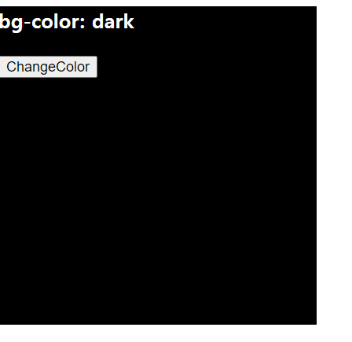
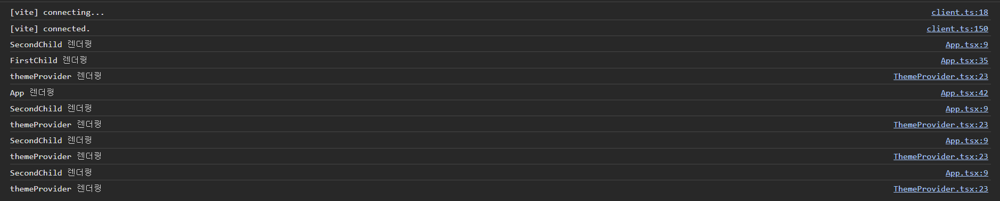

## useContext에 관한 오해

상태 관리 라이브러리로 redux, recoil, zustand, mobx 등을 활용합니다. 이때 많은 react 개발자들이 간단한 다크 theme등의 구현이 필요할때는 무거운 상태관리 라이브러리를 사용하지 말고 useContext를 사용하면 된다고 이야기 합니다. 하지만 이는 useContext에 관한 오해에서 비롯 된 것입니다. 

본질적으로 **useContext는 상태를 주입해주는 API**입니다. useContext만을 활용해서 상태를 기억하고 관리하는 것은 불가능합니다.**useContext의 본질적인 목적은 props drilling을 피하기 위함**임을 기억해야 합니다. 

useContext가 상태관리 라이브러리와 같은 역할을 하기 위해서는 다음 두 가지 조건을 만족해야 합니다. 

    1. 어떠한 상태를 기반으로 다른 상태를 만들 수 있어야 합니다. 
    2. 필요에 따라 이러한 상태 변화를 최적화 할 수 있어야 한다. 

하지만 context는 둘 중 어느 것도 만족 하지 못합니다. 단순히 prop 값을 하위로 전달할 뿐 렌더링이 최적화 되지 않습니다. 

그렇다면 state의 상태 변화를 감지하는 useState 혹은 useReducer 와 useContext를 함께 사용하면 어떤 차이가 있을까? 

### useContext를 활용한 다크 모드 구현을 통한 렌더링 이해 

useContext를 활용해 간단하게 `dark-mode`, `light-mode`를 관리하도록 만들었습니다. 

```tsx
// Theme Prorvider 생성

import React from 'react';

// 각 context의 타입을 지정
export type theme = 'dark' | 'light';
export type setTheme = React.Dispatch<React.SetStateAction<theme>>;

export const ThemeContext = React.createContext<theme | null>(null);
export const SetThemeContext = React.createContext<setTheme | null>(null);

export default function ThemeProvider({
  children,
}: {
  children: React.ReactNode;
}) {
  // 색상을 관리할 state 생성
  const [theme, setTheme] = React.useState<theme>(() => {
    const isDarkMode = window.matchMedia(
      '(prefers-color-scheme: dark)',
    ).matches;
    return isDarkMode ? 'dark' : 'light';
  });

  React.useEffect(() => {
    console.log('themeProvider 렌더링');
  });

  return (
    <ThemeContext.Provider value={theme}>
      <SetThemeContext.Provider value={setTheme}>
        {children}
      </SetThemeContext.Provider>
    </ThemeContext.Provider>
  );
}
```

```tsx
//App.tsx
import { useContext, useEffect } from 'react';
import ThemeProvider, {
  SetThemeContext,
  ThemeContext,
} from '@/components/ThemeProvider';

function SecondChild() {
  useEffect(() => {
    console.log('SecondChild 렌더링');
  });
  const theme = useContext(ThemeContext);
  const setTheme = useContext(SetThemeContext);
  return (
    <section
      style={{
        backgroundColor: theme === 'light' ? 'white' : 'black',
        width: '300px',
        height: '300px',
      }}>
      <h3 style={{ color: theme === 'light' ? 'black' : 'white' }}>
        bg-color: {theme}
      </h3>
      <button
        onClick={() => {
          setTheme!(prev => (prev === 'dark' ? 'light' : 'dark'));
        }}>
        ChangeColor
      </button>
    </section>
  );
}

function FirstChild() {
  useEffect(() => {
    console.log('FirstChild 렌더링');
  });
  return <SecondChild />;
}

function App() {
  useEffect(() => {
    console.log('App 렌더링');
  });
  return (
    <>
      <ThemeProvider>
        <FirstChild />
      </ThemeProvider>
    </>
  );
}

export default App;
```

useEffect를 통해서 언제 렌더링이 이루어지는지 관찰했습니다. 초기 화면은 아래와 같습니다. 



이후 버튼을 클릭해서 ThemeProvider의 state 값을 변경하면 리렌더링이 발생하는 컴포넌트를 다음과 같이 확인할 수 있습니다. 즉 SecondChild와, ThemeProvider에서 리렌더링이 발생하는 것을 확인할 수 있습니다. 


즉 contextProvider에서 children 요소를 통해 Component를 전달하기 때문에, 모든 자식 Component가 리렌더링이 발생하지 않고 리렌더링이 필요한 Component에만 리렌더링이 발생하는 것을 확인할 수 있었습니다. 

개인적으로는 렌더링이 어떻게 발생하는지 확인할 수 있었기 때문에, 간단한 상태 주입 뿐만 아니라, 배경과 같은 상태를 관리할 필요가 있다면, 무거운 상태관리 라이브러리가 아닌, useContext를 활용해도 충분하지 않은가? 생각할 수 있었습니다. 