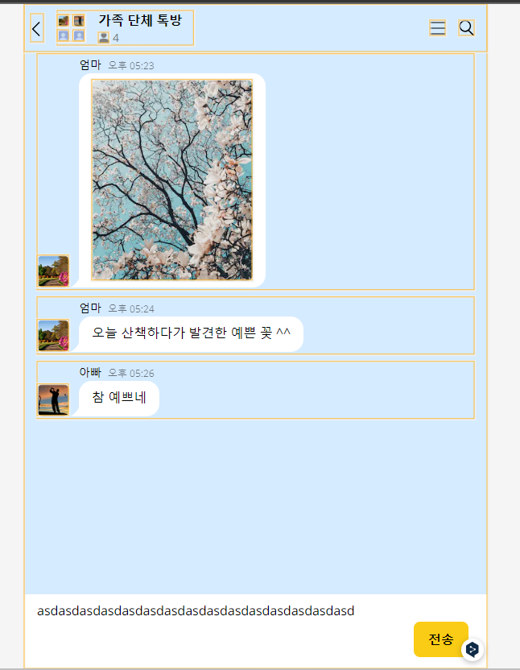

# 제어 컴포넌트와 비제어 컴포넌트

## 리엗트의 렌더링이 일어나는 이유

1. **최초 렌더링**
    
    사용자가 처음 애플리케이션에서 진입하면 정보를 제공하기 위해 최초 렌더링을 수행합니다.
    
2. **클래스형 컴포넌트의 setState가 실행되는 경우**
    
    state의 변화는 컴포넌트 상태의 변화를 의미합니다. 클래스형 컴포넌트에서는 state의 변화를 setState 호출을 통해 수행하므로 리렌더링이 발생합니다. 
    
3. **클래스형 컴포넌트의 forceUpdate가 실행되는 경우**
    
    클래스형 컴포넌트에서 렌더링을 수행하는 것은 인스턴스 메서드인 `render`입니다. 만약 render가 **state나 props가 아닌 다른 값에 의존하고 있어 리렌더링을 자동으로 실행할 수 없을 경우 `forceUpdate`를 실행해 리렌더링을 일으킬 수 있습니다.**
    
    **`forceUpdate`** 를 실행하면 개발자가 강제로 렌더링이 필요하다고 선언한 것으로 간주해 **`shouldComponentUpdate`**는 무시하고 건너뜁니다. 이는 자기 자신 뿐만 아니라 하위 모든 컴포넌트에 적용된다. 
    
    이때 render 내에서 실행 되면 무한 루프가 발생되기 때문에 render 내부에서 사용하면 안됩니다. 
    
4. **함수형 컴포넌트의 useState() 두 번째 배열 요소인 setter가 실행되는 경우**
    
    `useState`가 반환하는 배열의 두번 째 인수는 클래스형 컴포넌트의 setState와 마찬가지로 state를 업데이트하는 함수입니다. 이 함수가 실행되면 렌더링이 일어납니다.
    
5. **함수형 컴포넌트의 useReducer의 두번째 요소 배열인 dispatch가 실행되는 경우**
    
    `useReducer` 도 `useState` 와 마찬가지로 상태와 이 상태를 업데이트 하는 함수를 배열로 제공합니다. 이 두 번째 배열 요소를 실행하면 컴포넌트의 렌더링이 일어납니다. 
    
6. **컴포넌트의 key props가 변경되는 경우**
    
    리엑트에서 `key` 는 명시적으로 선언돼 있지 않더라도 모든 컴포넌트에서 사용할 수 있는 props 입니다. 
    
    **리엑트에서 `key` 는 리렌더링이 발생하는 동안 형제 요소들 사이에서 동일한 요소를 식별하는 값입니다.** `key` 가 존재한다면, 두 트리 사이에서 동이란 key를 가지고 있는 컴포넌트는 이를 기준으로 구별합니다. `key` 가 없다면 단순한 파이버 내부의 sibling 인덱스만을 기준으로 판단합니다. 
    

## 렌더와 커밋

1. **Render phase**
    
    Render phase는 **VDOM을 재조정(Reconciliation)하는 일련의 과정**입니다. **컴포넌트 호출은 Render phase에서 실행되며 호출이 곧 화면 반영을 나타내는 것은 아닙니다.** 컴포넌트가 리-렌더링 된다는 말은 컴포넌트가 호출되고 그 결과가 VDOM에 반영된다는 것이지 DOM에 마운트되어 페인트 된다는 뜻은 아닙니다.
    
2. **Commit phase**
    
    **Commit phase는 Render phase에서 재조정된 VDOM을 DOM에 적용하고 라이프 사이클을 실행하는 단계**입니다. 여기서도 마찬가지로 DOM에 마운트된다는 것이지 페인트 된다는 건 아닙니다. **이 단계가 끝나고 리액트에서 콜 스택을 비워줘야지만 브라우저에서 화면을 페인트** 할 수 있게 됩니다.
    

> **즉 리엑트의 렌더링이 일어난다고 해서 무조건 DOM 업데이트가 일어나는 것은 아닙니다.** 렌더링을 수행했으나, 커밋 단계까지 갈 필요가 없다면(변경 사항이 없다면) 커밋 단계는 생략 될 수 있습니다.
> 

## 제어 컴포넌트

이때 **input을 state로 관리하는 경우 input에 입력된 값이 변경될 때 마다, 해당 컴포넌트에 모두 리렌더링이 발생**합니다. 왜냐하면, 입력값이 추가되거나 지워질 경우 state가 변경되어 리렌더링이 발생하기 때문입니다. 

이는 input값과 직접적인 연관이 없는 다른 컴포넌트에도 랜더링을 발생시켜 브라우저 전체를 느리게 만들 수 있습니다.  위의 예시는 input 값을 state로 제어 하도록 만든 컴포넌트입니다. 이때 해당 input state 값을 관리하는 컴포넌트의 모든 컴포넌트(자식 컴포넌트 포함)가 input 값이 변경 될 때 마다 리렌더링이 발생하고 있습니다. 



```tsx
// 제어 컴포넌트로 input 관리하기
<input
          type="text"
          id="nickname"
          value={nickname}
          ref={inputRef}
          onChange={e => {
            setNickName(e.target.value);
          }}
          required
          autoFocus
          placeholder="닉네임을 입력해주세요"
          className="focus:outline-none px-4 py-4 border-2 border-solid border-[#E1E1E1] bg-white col-span-2 font-semibold"
        />
```

해당 방법이 웹페이지의 성능을 매우 약화시킨다는 것을 알 수 있었습니다. 필요로 하지 않는 렌더링이 무분별하게 발생하기 때문이죠. 해당 문제를 해결하기 위해 제어컴포넌트가 아닌 비제어 컴포넌트로 문제를 처리하기로 했습니다. 

## 비제어 컴포넌트

비제어 컴포넌트는 `useRef` 를 활용합니다. **useRef는 저장 공간, 또는 특정 DOM에 직접적으로 접근하기 위해 사용되는 리액트 훅**입니다. useRef를 활용하면 다음 렌더링에도 동일한 객체를 반환하기 때문에, state의 변환이 발생하지 않습니다. 따라서 input jsx 태그를 useRef를 통해 관리하면 무분별한 리렌더링을 막을 수 있습니다.

위의 이미지에서 textarea를 state로 관리하지 않고 ref를 통해서 관리하도록 변경했습니다. 

```tsx
'use client';

import { useState, useRef, useEffect } from 'react';
import { postAnswer } from '@/api/clientApi';
import Chat from '@/components/chat/Chat';
import SelectMessageForm from '@/components/chat/SelectMessageForm';
import ChatingDetailHeader from '@/components/layout/ChatingDetailHeader';
import Loading from '@/components/Loading';
import useGetOneAnswer from '@/hooks/useGetOneAnswer';
import useLocalStorage from '@/hooks/useLocalStorage';
import useResize from '@/hooks/useResize';
import useSetVisited from '@/hooks/useSetVisited';
import { Id } from '@/types/types';

type Prop = {
  pageId: Id;
  isVisited: boolean;
};

export default function ChatPage({ pageId, isVisited }: Prop) {
  const [isLoading, question, userInfo] = useGetOneAnswer(pageId);
  const [token] = useLocalStorage<null | string>('token', null);
  const [answers, setAnswers] = useState<string[]>([]);
  const textRef = useRef<HTMLTextAreaElement>(null);

  const handleSendMessage = async () => {
    if (textRef.current?.value) {
      const inputValue = textRef.current?.value;
      setAnswers(prev => [...prev, inputValue]);
      if (token) await postAnswer(textRef.current.value, question.id, token);

      textRef.current.value = '';
      textRef.current.focus();
    }
  };

    return (
        <section className="relative w-full bg-white mt-2">
          <textarea
            rows={3}
            className="w-full pr-24 pl-4 py-2 focus:outline-none resize-none scroll-div bg-white"
            placeholder={`(${question.description})`}
            ref={textRef}
          />
          <button
            className={`absolute bottom-4 right-6 border-2 border-solid px-4 py-2 rounded-lg border-yellow-400 bg-yellow-400 font-bold text-black `}
            onClick={handleSendMessage}>
            전송
          </button>
        </section>
      </section>
    );
}
```


채팅이 변경되도 리렌더링이 발생하지 않고 있습니다. 

## useRef의 단점

- state로 관리했을 때에 state의 변경에 따라서 css 변경을 쉽게 할 수 있었습니다. 이는 리엑트가 리렌더링을 촉발시키는 trigger가 되기 때문입니다.
- 하지만 useRef를 활용할 경우, ref의 값에 따라서 css를 변경할 수 없었습니다. ref 는 참조 값이고 ref의 변경은 리렌더링을 발생시키지 않기 때문입니다. 따라서 css를 조건에 따라 분기 처리를 할 수 없었습니다.