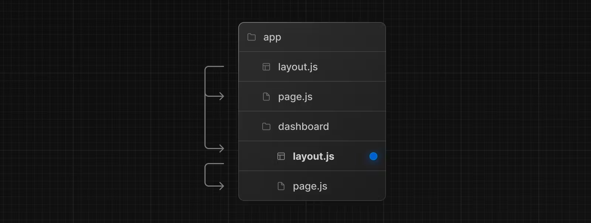
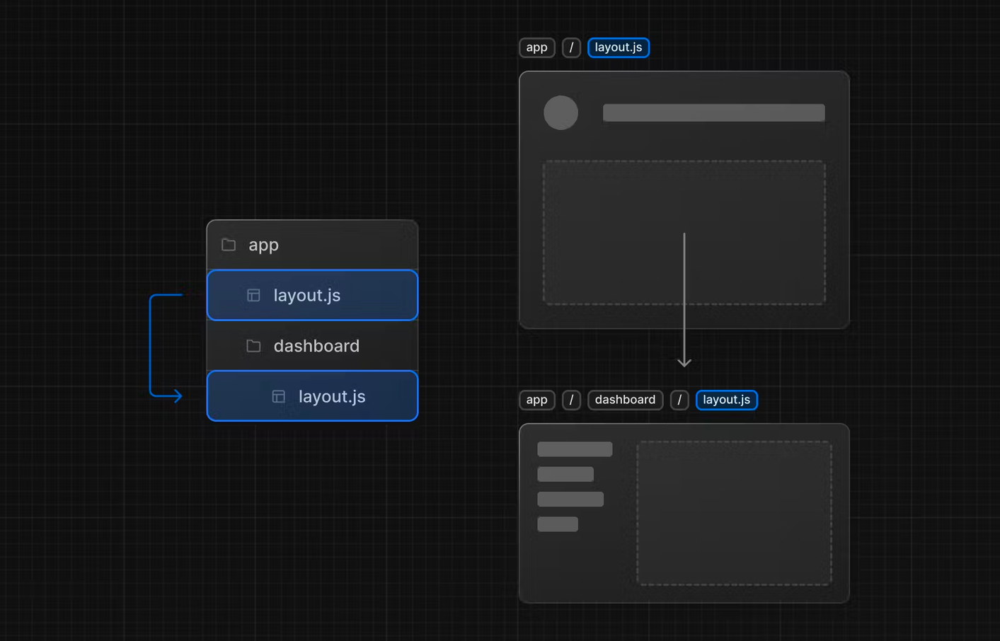
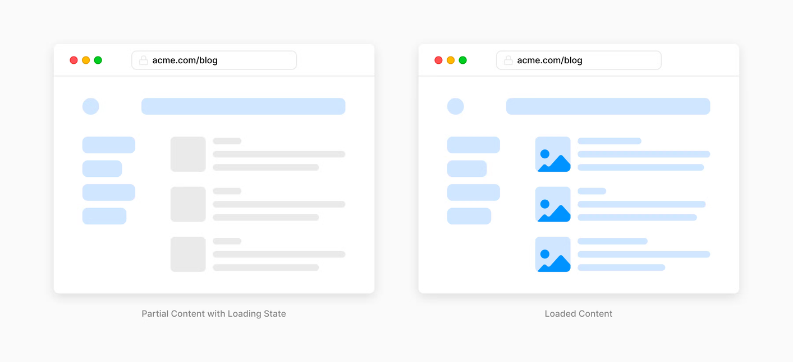
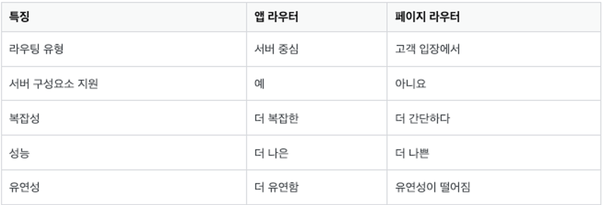

# Next.js 업데이트 살펴보기

교재의 Next.js의 버전은 12.2.5로 현재 쓰이는 13, 14버전과 다소 차이가 있어, 그 점을 정리해 보았습니다.

## 💠Next.js 13 업데이트

### 🔹Page Router와 App Router

기존 Next.js는 /page 폴더에 모든 웹 사이트의 페이지 컴포넌트를 처리하곤 했다. React에 비해 라우팅 설정을 하나도 하지 않아도 파일 구조를 이용해서 Next.js에서 기본으로 지원하는 라우팅을 훌륭하게 사용하여 개발이 효율적이기도 했다.

만약 /user 폴더 아래에 change-username.tsx 라는 파일이 있으면
`http://프로젝트/user/change-username` 와 같은 url로 접속 시 프로젝트가 라우팅되어 동작한다. 이러한 Next.js에서 기본 제공되는 라우터를 Page Router라고 부른다.

#### App Router

기존에 pages/ 디렉토리에서 라우팅 되던 방식과 다르게, app/ 디렉토리로 라우팅 하는 방식이 추가되었다.

- app/ 디렉토리를 생성하여 라우팅을 설정할 수 있으며, 라우팅 환경 개선 뿐만 아니라, 레이아웃, 서버 컴포넌트, 스트리밍, 데이터 패칭까지도 지원하는 형태로 향상되었다.
  - Layout: 리렌더링 방지를 위한 레이아웃 제공 (기존 \_app.tsx 파일과 비슷한 개념)
  - Server Component: app 디렉토리 내 파일은 디폴트로 서버 컴포넌트로 동작함
  - Streaming: app 디렉토리는 렌더링되는 UI 단위를 점진적으로 렌더링 & 스트리밍할 수 있는 기능 제공
  - Data Fetching 지원: fetch() Web API를 사용할 수 있게 되어, 컴포넌트 레벨에서도 SSR 적용 가능

### 🔹Layout

> 상태를 유지하고 Rerendering을 방지하면서 자체 경로 안의 컴포넌트와 UI를 쉽게 공유할 수 있다.

App Router에서는 `https://프로젝트/dashboard` 라우팅을 위해 아래와 같은 `/app/dashboard/page.js` 파일을 생성해야 한다.

```js
// app/dashboard/page.js
export default function Page() {
  return <h1>Hello, Next.js!</h1>;
}
```

이제 같은 폴더 내에 layout 파일을 정의한다. 레이아웃은 여러 페이지 간에 UI를 공유한다. 레이아웃은 상태를 유지하고 해당 폴더 내에서 탐색할때 다시 렌더링되지 않는 장점이 있다. 마치 전역 컴포넌트를 정의한 것처럼!

```js
// app/dashboard/layout.js
export default function BlogLayout({ children }) {
  return <section>{children}</section>;
}

// 이 레이아웃 파일은 dashboard 안의 모든 곳에서 사용되며 다시 렌더링되지 않는다.
```

<!--




app 디렉토리 루트에 있는 RootLayout은 필수이며, 그 하위에 있는 폴더에서는 커스텀 레이아웃을 만들 수 있다. 이때, 위 사진처럼 상위 레이아웃이 하위 레이아웃을 감싸는 구조이다.

```js
// app/layout.js (필수)
export default function RootLayout({ children }) {
  return (
    <html lang="en">
      <body>{children}</body>
    </html>
  );
}
``` -->

### 🔹Server Component

> React의 서버 컴포넌트 아키텍처 지원

`app directory` 내부에서는 모든 컴포넌트가 기본적으로 **서버 컴포넌트**로 동작한다.

서버 컴포넌트를 통해 프론트엔드 서버에서 html을 빌드하여 클라이언트로 보내는데, 클라이언트로 전송되는 JS코드 양을 줄이고, 복잡한 인터페이스를 구축할 수 있어 초기 페이지 로드 속도를 빠르게 해준다.

URL이 로드되면 Next.js와 React 런타임이 로드된다. 이렇게 되면 **캐시를 사용할 수 있고 런타임이 예측 가능**하다. 애플리케이션이 커져도 런타임 크기가 늘어나지 않는다. 런타임이 비동기로 로드되기 때문에 서버의 HTML이 클라이언트에서 점진적으로 향상될 수 있다.

서버 컴포넌트 vs 클라이언트 컴포넌트: 컴포넌트가 렌더링 되는 장소가 서버인지 클라이언트인지의 차이. 서버 컴포넌트는 서버에서 한 번 해석 된 후 클라이언트로 전달된다.

```js
"use client";

import { useState } from "react";

export default function Counter() {
  const [count, setCount] = useState(0);

  return (
    <div>
      <p>You clicked the Count++ button {count} times</p>
      <button onClick={() => setCount(count + 1)}>Count++</button>
    </div>
  );
}
```

만약 `app directory` 내부에서 클라이언트 컴포넌트를 사용하고 싶다면 파일 최상단에 `use client`라는 directive를 명시해야 한다.

- useState, useEffect 훅을 사용하는 경우
- 특정 브라우저 API에 의존성이 있는 경우
- 특정 Event Listeners를 추가하는 경우

### 🔹Streaming

> 로딩 상태 표시 & 렌더링되는 UI 단위 스트리밍

dashboard 내부에 `loading.js`를 추가하면 어떤 위치에서 로딩할때 이미 Next.js에서 로드된 `loading.js` 파일 기반의 컴포넌트를 사용하여 로딩 중임을 표시하고, 데이터가 로딩이 완료된 부분을 먼저 표시한다.

<!-- React의 Suspense와 상당히 비슷하다. -->

<!-- app/ 디렉토리는 UI의 렌더링 단위를 **점진적으로 렌더링**하고 렌더링된 단위를 클라이언트로 부분적으로 스트리밍할 수 있는 기능을 제공한다.

SSR로 렌더링을 하면 블로킹이 될 수 있다. 이를 개선하기 위해 스트리밍으로 페이지의 HTML을 작은 **청크로 분할**하고, 서버에서 클라이언트로 점진적으로 청크를 전송할 수 있다. 이를 통해 UI를 렌더링하기 전에 모든 데이터를 기다릴 필요 없이 페이지의 일부를 더 빨리 표시할 수 있게 된다. -->



```js
/* app/dashboard/loading.tsx */

export default function Loading() {
  // You can add any UI inside Loading, including a Skeleton.
  return <LoadingSkeleton />;
}
```

### 🔹Data Fetching

> 데이터를 가져오고 Promise를 처리하는 새로운 방법. <br/> 개선된 Next.js용 fetch Web API (중복 요청 제거, 데이터 캐시, 유효성 검증 등)와 함께 사용하면 SSG, SSR, ISR의 모든 이점을 하나의 API로 제공할 수 있다.

- fetch() Web API를 사용할 수 있게 되면서, 이제는 컴포넌트 레벨에서도 SSR의 적용이 가능해진 것.
- React는 fetch() API의 중복제거를 제공하며, Next.js는 캐싱과 재요청 처리까지 지원
- 이를 통해, 기존의 SSG, SSR, ISR(Incremental Static Regeneration) 등의 기법을 아래와 같은 fetch() 옵션으로 대체 가능하다.

```js
// This request should be cached until manually invalidated.
// Similar to `getStaticProps`.
// `force-cache` is the default and can be omitted.
fetch(URL, { cache: "force-cache" });

// This request should be refetched on every request.
// Similar to `getServerSideProps`.
fetch(URL, { cache: "no-store" });

// This request should be cached with a lifetime of 10 seconds.
// Similar to `getStaticProps` with the `revalidate` option.
fetch(URL, { next: { revalidate: 10 } });
```

```js
async function getData() {
  const res = await fetch("https://api.example.com/...");
  // The return value is *not* serialized
  // You can return Date, Map, Set, etc.
  return res.json();
}

// This is an async Server Component
export default async function Page() {
  const data = await getData();

  return <main>{/* ... */}</main>;
}
```

단, Next.js에서 기본 제공되는 fetch API를 사용해야 하며, 그 외의 서드파티 api 라이브러리 사용시 캐싱을 따로 해야한다. 기존 `getStaticPages` 등 Next.js에서 지원했던 기능은 서버 컴포넌트가 생김으로 무의미해졌다.

## 💠Page Router와 App Router의 비교


(서버 구성요소 = 서버 컴포넌트를 의미)

### 🔹목적과 스트럭처에서의 차이점

#### 목적

- App Router: 전체 애플리케이션에 대한 전반적인 라우팅 및 탐색을 처리한다. URL을 기반으로 올바른 페이지를 렌더링하고 페이지간 전환을 관리한다.

- Page Router: 애플리케이션의 개별 페이지 내에 라우팅을 처리한다. 이를 통해 동적 경로를 만들고, 특정 콘텐츠를 렌더링하기 위한 경로 paramater에 접근할 수 있다.

#### 스트럭처

- App Router: \_app.js 파일에 구현되어 전체 애플리케이션을 래핑한다.

- Page Router: 각 개별 페이지 구성요소에 구현된다.

---

#### reference

https://www.jadru.com/diffrent-approuter-and-pagerouter

https://velog.io/@khy226/Next.js-13-%EC%97%85%EB%8D%B0%EC%9D%B4%ED%8A%B8-%EB%90%9C-%EB%82%B4%EC%9A%A9-%EC%A0%95%EB%A6%AC-App-%EB%9D%BC%EC%9A%B0%ED%84%B0-%EC%9E%90%EC%84%B8%ED%9E%88-%EC%95%8C%EC%95%84%EB%B3%B4%EA%B8%B0#data-fetching
