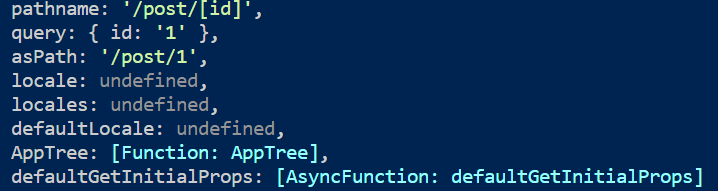

## 💠Next.js란?

Vercel이라는 미국 스타트업에서 PHP에 영감을 받아 만든 리액트 기반 서버 사이드 렌더링 프레임워크. 리액트에서 SSR을 언급하면 가장 먼저 떠올리는 프레임워크이며 대명사라고 해도 과언이 아니다.

Next.js가 대세가 되기 전에 페이스북 팀에서 리액트 기반 SSR을 위해 고려했던 프로젝트가 react-page린데, 여기서 구현해 둔 방향성에 Next.js가 영감을 받아 개발되었다.

## 💠Next.js 시작하기

CRA와 비슷하게 Next.js는 create-next-app을 제공하여 개발자가 빠르게 Next.js 기반 프로젝트를 생성할 수 있게 돕는다.

### 🔹package.json

프로젝트 구동에 필요한 모든 명령어 및 의존성이 포함되어 있으므로 프로젝트의 대략적인 모습을 확인할 수 있다.

```js
{
  "name": "my-app",
  "version": "0.1.0",
  "private": true,
  "scripts": {
    "dev": "next dev",
    "build": "next build",
    "start": "next start",
    "lint": "next lint"
  },
  "dependencies": {
    "next": "14.0.4",
    "react": "18.2.0",
    "react-dom": "18.2.0"
  },
  "devDependencies": {
    "@types/node": "20.10.6",
    "@types/react": "18.2.46",
    "@types/react-dom": "18.2.18",
    "eslint": "8.56.0",
    "eslint-config-next": "14.0.4",
    "typescript": "5.3.3"
  }
}

```

#### 눈에 띄는 주요 의존성

- next : Next.js의 기반이 되는 패키지.
- eslint-config-next: Next.js 기반 프로젝트에서 사용하도록 만들어진 ESLint 설정으로 구글과 협업해 만든 핵심 웹 지표(core web vital)에 도움이 되는 규칙들이 내장되어 있다. Next.js 기반 프로젝트라면 꼭 사용하는 것을 권장하고 있다. (eslint-config-airbnb처럼 기존에 사용하던 규칙이 있다면 이에 추가로 함께 사용하는 것을 추천)

### 🔹next.config.js

그 다음으로 눈여겨볼 파일은 next.config.js 파일이다. 이 파일은 Next.js 프로젝트의 환경 설정을 담당하며, Next.js를 자유자재로 다루려면 반드시 알아야 하는 파일이다.

```js
/** @type {import('next').NextConfig} */
const nextConfig = {
  reactStrictMode: true,
  swcMinify: true,
};

module.exports = nextConfig;
```

- 첫 줄에 있는 주석은 JS 파일에 TS의 타입 도움을 받기 위해 추가된 코드.
  해당 주석이 있다면 next의 NextConfig를 기준으로 타입의 도움을 받을 수 있는 반면 없으면 일일히 타이핑해야 한다.

- reactStrictMode : 리액트의 엄격모드와 관련된 옵션으로 리액트 앱 내부에서 잠재적인 문제를 개발자에게 알리기 위한 도구. 특별한 이유가 없다면 켜두는 것이 도움이 된다.

- swcMinify : Vercel의 또 다른 오픈소스인 SWC(번들링과 컴파일을 더욱 빠르게 수행하기 위해 만들어 짐. 바벨의 대안)을 기반으로 코드 최소화 작업을 할 것인지 여부를 설정하는 속성. 바벨보다 빨라서 특별한 이유가 없다면 이걸 쓰는 걸 권장.

### 🔹pages/app.tsx

```js
import "../styles/globals.css";
import type { AppProps } from "next/app";

function MyApp({ Component, pageProps }: AppProps) {
  return <Component {...pageProps} />;
}

export default MyApp;
```

애플리케이션의 전체 페이지의 시작점. 이 특징 때문에 웹앱에서 공통으로 설정해야 하는 것들을 여기에서 실행할 수 있다.

- 에러 바운더리를 사용해 애플리케이션 전역에서 발생하는 에러 처리
- reset.css 같은 전역 css 선언
- 모든 페이지에 공통으로 사용 또는 제공해야 하는 데이터 제공 등

### 🔹pages/\_document.tsx

create-next-app으로 생성하면 존재하지 않는다. pages 아래에 만들어서 넣어줘야 한다. 즉, 실행에 지장은 없지만 생성해두면 몇 가지 시나리오에서 유용한 도움을 준다.

```js
import { Html, Head, Main, NextScript } from "next/document";

export default function Document() {
  return (
    <Html lang="ko">
      <Head />
      <body className="body">
        <Main />
        <NextScript />
      </body>
    </Html>
  );
}
```

\_app.tsx가 앱 페이지 전체를 초기화하는 곳이라면 \_document.tsx는 앱의 HTML을 초기화하는 곳이다. 따라서 \_app.tsx와 다음과 같은 몇 가지 차이점이 있다.

- `<html>`이나 `<body>`에 DOM 속성을 추가하고 싶다면 \_document.tsx를 사용한다

- \_app.tsx는 렌더링이나 라우팅에 따라 서버나 클라이언트에서 실행될 수 있지만 \_document는 무조건 서버에서 실행된다. 따라서 onClick과 같은 핸들러를 추가하는 것은 불가능하다. 이벤트를 추가하는 건 클라이언트에서 실행되는 `hydrate`의 몫이기 때문.

- Next.js에는 두 가지 `<head>`가 존재하는데 하나는 next/document에서 제공되고 하나는 next/head에서 제공된다. 브라우저의 `<head>`와 동일한 역할을 하지만 next/document는 오직 \_document.tsx에서만 사용할 수 있다. next/head는 페이지에서 사용할 수 있으며, SEO에 필요한 정보나 title 등을 담을 수 있다. 또한 next/document의 `<head>` 내부에는 `<titel />`을 사용할 수 없다. (경고 발생) 웹앱의 공통적 타이틀이 필요하면 \_app에, 페이지 별 타이틀이 필요하면 페이지 파일 내부에서 후자를 사용하면 된다.

- `getServerSideProps`, `getStaticProps` 등 서버에서 사용 가능한 데이터 불러오기 함수는 여기에서 사용할 수 없다.

- \_document.tsx에서만 할 수 있는 또 한 가지 작업은 바로 CSS-in-JS의 스타일을 서버에서 모아 HTML로 제공하는 작업.

즉, \_app은 Next.js를 초기화하는 파일로 Next.js 설정과 관련된 코드를 모아두는 곳이며, 경우에 따라 서버와 클라이언트 모두에서 렌더링될 수 있지만, \_document는 Next.js로 만드는 웹사이트의 뼈대가 되는 HTML 설정과 관련된 코드를 추가하는 곳이며 반드시 서버에서만 렌더링된다.

### 🔹pages/\_error.tsx

해당 파일 역시 원래는 없다. 클라이언트에서 발생하는 에러 또는 서버에서 발생하는 500 에러를 처리할 목적으로 만드는 파일. Next.js 프로젝트 전역에서 발생하는 에러를 적절하게 처리하고 싶다면 이 페이지를 활용하면 된다.

```js
import { NextPageContext } from "next";

function Error({ statusCode }: { statusCode: number }) {
  return (
    <p>
      {statusCode ? `서버에서 ${statusCode}` : "클라이언트에서"} 에러가
      발생했습니다.
    </p>
  );
}

Error.getInitialProps = ({ res, err }: NextPageContext) => {
  const statusCode = res ? res.statusCode : err ? err.statusCode : "";
  return { statusCode };
};

export default Error;
```

### 🔹pages/404.tsx

```js
export default function My404Page() {
  return <h1>페이지를 찾을 수 없습니다.</h1>;
}
```

이름에서 알 수 있듯이 404 페이지를 정의할 수 있는 파일로 원하는 스타일의 404 페이지를 이곳에서 만들 수 있다. 만들지 않으면 Next.js에서 기본으로 제공하는 404 페이지를 볼 수 있다.

### 🔹pages/500.tsx

```js
export default function My500Page() {
  return <h1>서버에서 에러가 발생했습니다.</h1>;
}
```

서버에서 발생하는 에러를 핸들링하는 페이지. \_error.tsx와 500.tsx 두 파일이 동시에 존재하면 500.tsx가 우선적으로 실행된다. 마찬가지로 500이나 error 페이지가 없다면 기본적으로 Next.js에서 제공하는 페이지를 볼 수 있다.

### 🔹pages/index.tsx

위에서 설명한 \_app, \_error, \_document, 404, 500은 Next.js에서 제공하는 예약어로 관리되는 페이지라면, 해당 파일부터는 개발자가 자유롭게 명칭을 지정해서 만들 수 있는 페이지이다.

라우팅이 파일명으로 이어지는 구조가 바로 react-pages에서 처음 만들어 진 것에 Next.js가 영감을 받아서 현재까지 이어지고 있다.

Next.js는 react-pages처럼 라우팅 구조는 /pages 디렉토리를 기초로 구성되며 각 페이지에 있는 default export로 내보낸 함수가 해당 페이지의 루트 컴포넌트가 된다.
(해당 구조는 Next.js 13이 등장하면서 App Router로 완전 바뀌게 된다. 따라서 @latest로 CNA을 하면 더이상 pages 폴더가 생성되지 않는다.)

아래는 예제 프로젝트의 구성을 정리한 것.

- /pages/index.tsx : 웹사이트의 **루트**이며, localhost:3000과 같은 루트 주소를 의미.

- /pages/hello.tsx : /pages가 생략되고, 파일명이 주소가 된다. localhost:3000/hello로 접근할 수 있다.

- /pages/hello/world.tsx : localhost:3000/hello/world 로 접근 가능.

- /pages/hello/[greeting].tsx : 여기서 `[]`의 의미는 여기에는 어떠한 문자도 올 수 있다는 뜻이다.
  <br/>이 [greeting]의 경우 서버 사이드에서 greeting이라는 변수에 사용자가 접속한 주소명이 오게 된다.
  <br/>예를 들어, localhost:3000/hello/1 이나 localhost:3000/hello/greeting 모두 유효하며, /pages/hello/[greeting].tsx 로 오게 된다. 그리고 greeting 변수에는 각각 1, greeting이라는 값이 들어온다. 만약 /pages/hello/world.tsx와 같이 이미 정의된 주소가 있다면 미리 정의해 둔 주소인 /pages/hello/world.tsx가 우선된다.

- /pages/hi/[...props].tsx : JS에서의 전개연산자와 동일하다. /hi를 제외한 /hi 하위의 모든 주소가 여기로 온다. 즉, localhost:3000/hi/hello/world/foo 등이 여기로 오게 된다. 그리고 이 [...props] 값은 props라는 변수에 **배열**로 오게 된다.

```js
import { useRouter } from "next/router";
import { useEffect } from "react";
import { NextPageContext } from "next";

export default function HiAll({ props: serverProps }: { props: string[] }) {
  // 클라이언트에서 값을 가져오는 방법
  const {
    query: { props },
  } = useRouter();

  useEffect(() => {
    console.log(props);
    console.log(JSON.stringify(props) === JSON.stringify(serverProps)); // true
  }, [props, serverProps]);

  return (
    <>
      hi{" "}
      <ul>
        {serverProps.map((item) => (
          <li key={item}>{item}</li>
        ))}
      </ul>
    </>
  );
}

export const getServerSideProps = (context: NextPageContext) => {
  // 서버에서 값을 가져오는 법
  const {
    query: { props }, // string || string[] || undefined
  } = context;

  // 서버에서 클라이언트로 값을 내려주는 것은 이후에
  return {
    props: {
      props,
    },
  };
};
```

위 페이지를 만약 /hi/my/name/is/3 로 접근하면 props에는 `['my', 'name', 'is', '3']`이 담기게 된다.
여기서 알 수 있듯이 주소에 숫자를 입력한다고 해서 숫자로 형변환되어 props에 담기지 않음에 주의해야 한다. 또한 주소에 하나만 들어가도 배열에 담긴다.

### 🔹서버 라우팅과 클라이언트 라우팅의 차이

Next.js는 SSR을 수행하지만 SPA과 같이 클라이언트 라우팅 또한 수행한다.

SSR 프레임워크이기 때문에 최초 페이지 렌더링은 서버에서 수행되는 것은 확실하다. (`console.log(window === undefined ? 'server : client')` 시 `server` 출력)

Next.js에서 제공하는 라우팅 컴포넌트 next/link는 `<a/>`와 동일한 역할을 하는 것 처럼 보이지만 크롬 개발자 도구에서 네트워크 부분을 살펴보면 `<a/>`를 사용하여 다른 페이지로 이동할 경우 모든 리소스(webpack, framework, main, hello 등)를 처음부터 다시 받는데 비해 `<Link />`는 해당 페이지로 이동하는 데 필요한 내용만 받는다.

따라서 `<a>` 를 사용하면 화면이 깜빡인 후에 페이지 라우팅을 하지만 `<Link>`를 사용하면 매우 매끄럽게 마치 SPA처럼 페이지 전환이 일어난다.
즉, next/link로 이동하는 경우 SSR이 아닌 클라이언트에서 필요한 JS만 불러온 뒤 라우팅하는 클라이언트 라우팅/렌더링 방식으로 작동.

- 규칙: `<a>` 대신 `<Link>` 사용, `window.location.push` 대신 `router.push` 사용

  Next.js는 SSR의 장점인 최초 페이지의 빠른 렌더링과 SPA의 장점인 자연스러운 라우팅, 이 두 가지 장점을 모두 살리기 위해 이러한 방식으로 작동한다.

### 🔹getServerSideProps

해당 구문을 빼고 빌드 실행하면 서버에 로그가 남지 않는다.
해당 구문이 있는 채로 빌드하면 서버 사이드 런타임 체크가 되어 있지만 없으면 빌드 크기가 약간 줄고 SSR이 필요없는 정적인 페이지로 분류되어, 서버에서 실행하지 않아도 되는 페이지로 처리하고 typeof window의 처리를 모두 object로 바꾼 뒤 빌드 시점에 미리 트리쉐이킹을 해버리기 때문.

이처럼 Next.js는 서버 사이드 렌더링 프레임워크지만 모든 작업이 서버에서 일어나는 것은 아님을 명심하자.

### 🔹pages/api/hello.ts

pages 하단에 api 폴더는 서버의 API를 정의하는 폴더로 /pages/api/hello.ts는 /api/hello로 호출할 수 있으며 이 주소는 다른 pages 파일과 다르게 HTML요청을 하는 게 아니라 단순히 서버 요청을 주고받게 된다.

여기에 있는 코드는 당연히 오직 서버에서만 실행된다. window나 document 등 브라우저에서만 접근할 수 있는 코드를 작성하면 문제가 발생한다.

## 🔹Data Fetching

Next.js에서는 SSR 지원을 위한 몇 가지 데이터 불러오기 전략이 있는데 이를 Data Fetching이라고 한다.

- 이 함수는 pages/의 폴더에 있는 라우팅이 되는 파일에서만 사용할 수 있으며, 예약어로 지정되어 반드시 정해진 함수명으로 export를 사용해 함수를 파일 외부로 보내야 한다.

- 이를 활용하면 서버에서 미리 필요한 페이지를 만들어서 제공하거나 해당 페이지에서 요청이 있을 때마다 서버에서 데이터를 조회하여 미리 페이지를 만들어서 제공할 수 있다.

### 🔹getStaticPaths & getStaticProps

이 두 함수는 사용자와 관계없이 정적으로 결정된 페이지를 보여주고자 할 때 사용되는 함수이다. 이 둘은 반드시 함께 사용되어야 한다.

예를 들어 /pages/post/[id]외 같은 페이지가 있고, 해당 페이지에 이 두 함수가 같이 사용되고 있다고 가정해 보자.

```js
import { GetStaticPaths, GetStaticProps } from "next";

export const getStaticPaths: GetStaticPaths = async () => {
  return {
    // prams로 들어올 수 있는 id 값은 1과 2뿐.
    paths: [{ params: { id: "1" } }, { params: { id: "2" } }],
    /* 반환값 중 하나로 미리 빌드해야 할 페이지가 너무 많은 경우 사용 가능. */
    fallback: false,
  };
};

export const getStaticProps: GetStaticProps = async ({ params }) => {
  const { id } = params;

  // prams로 1인지 2인지 받아와서 id에 따른 데이터를 fetch해서 post에 담아준다.
  const post = await fetchPost(id);

  return {
    props: {
      post,
    },
  };

  export default function Post({ post }: { post: Post }) {
    // post로 페이지를 렌더링 한다.
  }
};
```

- getStaticPaths

  - /pages/post/[id]가 접근 가능한 주소를 정의하는 함수
  - 즉, 이 페이지는 /post/1과 /post/2만 접근이 가능함을 의미하며 /post/3에서는 404를 반환한다.

- getStaticProps

  - 위에서 정의한 페이지에서 요청이 왔을 때 제공한 props를 반환하는 함수.

- fallback 옵션

  - paths에 미리 빌드해 둘 몇 개의 페이지만 리스트로 반환하고, true나 "blocking"으로 값을 선언할 수 있다. 이렇게 하면 next build를 실행할 때 미리 반환해 둔 paths에 기재되어 있는 페이지만 미리 빌드하고 나머지 페이지는
    - true일 경우 : 빌드되기 전까지는 fallback 컴포넌트를 보여주고 빌드가 완료된 이후에 해당 페이지를 보여준다.

  ```js
  function Post({ post }: { post: Post }) {
    const router = useRouter();

    if (router.isFallback) {
      return <div>Loading...</div>;
    }

    // post 렌더링
  }
  ```

이처럼 이 두 함수는 정적인 데이터만 제공하면 되는 사이트의 경우 매우 유용하게 사용할 수 있다. 만약 제공해야 할 페이지 수가 적다면 페이지를 빌드 시점에 미리 준비해 두거나 혹은 fallback을 이용해 사용자의 요청이 있을 때만 빌드하는 등의 **최적화**를 추가할 수도 있다.

### 🔹getServerSideProps

```js
export const getServerSideProps: GetServerSideProps = async (context) => {
  const {
    query: { id = "" },
  } = context;

  const post = await fetchPost(id.toString());
  return {
    props: { post },
  };
};
```

서버에서 실행되는 함수이며 해당 함수가 있다면 무조건 페이지 진입 전에 이 함수를 실행한다. (응답에 따라 페이지 루트 컴포넌트에 props반환 or 다른 페이지로 리다이렉트 등)
<br/> 이 함수가 있다면 Next.js는 꼭 서버에서 실행해야 하는 페이지로 분류해 빌드 시에도 서버용 JS파일을 별도로 만든다.

Next.js의 SSR은 getServerSideProps의 실행과 함께 이뤄지며, 여기서 반환받은 정보를 기반으로 페이지를 렌더링한다.

일반적인 리액트의 JSX와 다르게 getServerSideProps의 props로 내려줄 수 있는 값은 JSON으로 제공할 수 있는 값으로 제한된다. 즉 JSON.stringify로 직렬화할 수 없는 class나 Date 등은 props로 제공할 수 없다.(error) 값에 대한 가공이 필요하다면 실제 페이지나 컴포넌트에서 하는 것이 옳다.

이 함수는 무조건 클라이언트가 아닌 서버에서만 실행되기 때문에 다음과 같은 제약이 있다.

- window, document 객체 접근 불가
- 브라우저와 다르게 서버는 자신의 호스트를 유추할 수 없기 때문에 protocol과 domain 없이 fetch 요청을 할 수 없다. 반드시 완전한 주소를 제공해야 한다.

해당 함수는 서버에서 실행되는 함수라는 것을 항상 기억하며 코드를 작성해야 한다.

또한 이 함수는 사용자가 매 페이지를 호출할 때마다 실행되고, 이 실행이 끝나기 전까지는 사용자에게 어떠한 HTML도 보여줄 수 없다. 따라서 이 함수 내부에서 실행하는 내용은 최대한 간결하게 작성해야 하므로 꼭 최초에 보여줘야 하는 데이터가 아니면 클라이언트에서 호출하는 것이 더 유리하다.

마지막으로 이 함수에서 어떤 조건에 따라 다른 페이지로 보내고 싶다면 redirect를 사용할 수 있다. 예제에서 post 조회에 실패한 경우 클라이언트에서 리다이렉트하면 아무리 리다이렉트를 초기화해도 JS가 어느 정도 로딩된 이후에 실행할 수 밖에 없다. 하지만 getServerSideProps를 사용하면 훨씬 더 자연스럽게 보여줄 수 있다.

### 🔹getInitialProps

getStaticProps나 getServerSideProps가 나오기 전에 사용할 수 있었던 유일한 페이지 데이터 불러오기 수단.
현재는 getStaticProps나 getServerSideProps 사용이 권장된다.

```js
Todo.getInitialProps = async (context) => {
  const {
    query: { id = "" },
  } = context;

  const response = await fetch(
    `https://jsonplaceholder.typicode.com/todos/${id}`
  );

  const result = await response.json();
  console.log("fetch complete!");
  return { todo: result };
};
```

가장 큰 차이점은 페이지 루트 함수에 정적 메서드로 추가한다는 점과 props 객체를 반환하는 것이 아니라 바로 객체를 반환한다는 점.

getInitialProps는 라우팅에 따라서 서버와 클라이언트 모두에서 실행이 가능한 메서드이다. 따라서 getInitialProps에 코드를 작성할 때는 반드시 주의를 기울여야 한다.

여기에 있는 코드는 때에 따라 서버와 클라이언트 모두에서 실행될 수 있으므로 이러한 특징을 감안해서 코드를 작성해야 한다.

#### context 객체



- pathname : 현재 경로명. 단 실제 경로가 아닌 페이지상 경로이다.

- asPath : 브라우저에 표시되는 실제 경로. pathname과 다르게 사용자에게 표시되는 주소가 보인다.

- query : URL에 존재하는 쿼리. 만약 `/todo/2?foo=bar&id=3` 처럼 쿼리 문자열이 추가돼 있다면 `{ foo: 'bar', id: '2' }` 객체가 반환된다. 단 [id]는 페이지의 query를 우선시하므로 반드시 다른 값으로 변경해야 한다.

- req : Node.js에서 제공하는 HTTP request 객체

- res : Node.js에서 제공하는 HTTP response 객체
