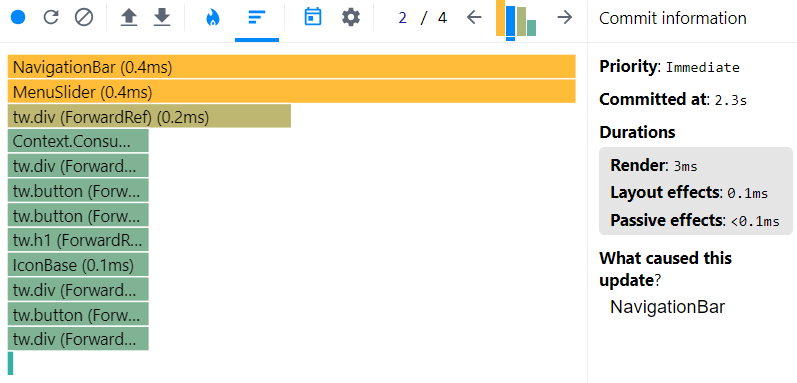
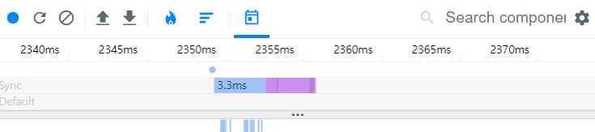

# 6.1 리액트 개발 도구란?

리액트 팀은 리액트 애플리케이션의 원활한 개발을 위한 개발 도구인 react-dev-tools를 만들어서 제공하고 있다. 이 개발 도구는 리액트로 만들어진 다양한 애플리케이션을 디버깅하기 위해 만들어졌으며, 웹앱 뿐 아니라 네이티브 등 다양한 플랫폼에서 사용 가능하다.

이 개발 도구를 사용하는 방법은 여러가지가 있지만, 웹 개발 환경에서 가장 편리하게 사용할 수 있는 방법은 브라우저 확장 프로그램을 사용하는 것.

(6.2 개발 도구 설치는 생략)

# 6.3 리액트 개발 도구 활용하기

리액트 개발자 도구를 정상적으로 설치 후 크롬 개발자 도구를 보면 Components와 Profiler가 추가된 것을 확인할 수 있다.
이 두 탭이 바로 리액트 개발자 도구에서 제공하는 디버그 도구.

## ✨컴포넌트(Components Tab)

Components 탭에서는 현재 리액트 애플리케이션의 컴포넌트 트리를 확인할 수 있다. 단순히 컴포넌트 구조 뿐만 아니라 props와 내부 hooks 등 다양한 정보를 확인할 수 있다.

### 🟡 컴포넌트 트리


Components의 왼쪽 영역은 해당 리액트 페이지의 컴포넌트 트리를 나타낸다. 리액트 애플리케이션 전체의 트리 구조를 한눈에 보여준다.

기명 함수로 선언되어 컴포넌트명을 알 수 있다면 해당 컴포넌트명을 보여주고, 익명 함수로 선언돼 있다면 Anonumous라는 이름으로 컴포넌트를 보여준다.

```js
const MemoizedComponent = memo(() => <>MemoizedComponent</>);
```

- memo를 사용해 익명 함수로 만든 컴포넌트를 감싼 경우, 함수명을 명확히 추론하지 못해서 Anonymous로 표시된다. (추가로 memo라벨이 부터 memo라벨을 통해 감싸진 컴포넌트임을 알 수 있다.)

```js
const withSampleHOC = (Component: ComponentType) => {
  return function () {
    return <Component />;
  };
};

const HOCComponent = withSampleHOC(() => <>HOCComponent</>);
```

- 고차 컴포넌트인 withSampleHOC로 감싼 HOCComponent의 경우 두 가지 모두 Anonymous로 선언돼 있다. 이 또한 고차 컴포넌트의 명칭을 제대로 추론하지 못했기 때문이다.

---

#### 🔸What is HOC(Higher-Order Components)?

컴포넌트 로직을 재사용하기 위한 React의 고급 기술로 React API의 일부가 아니며, React의 구성적 특성에서 나오는 패턴이다.

구체적으로, 고차 컴포넌트는 컴포넌트를 가져와 새 컴포넌트를 반환하는 함수라고 할 수 있다.
컴포넌트는 props를 UI로 변환하는 반면에, 고차 컴포넌트는 컴포넌트를 새로운 컴포넌트로 변환한다.

고차 컴포넌트는 횡단 관심사(Cross-Cutting concerns)를 분리하는데 도움을 준다.

```js
{/* 전체 어플리케이션을 담당하는 App 컴포넌트 */}
<App>
{/* 브라우저 요청 따라 컴포넌트를 선택하는 것이 Router 컴포넌트 */}
  <Router>
{/* UI 렌더에 필요한 데이터 처리는 Container 컴포넌트의 역할 */}
    <Container>
{/* UI를 렌더링하는 것은 Page 컴포넌트 */}
      <Page>
```

이처럼 어플리케이션은 계층으로 분리하지만 기능까지 완벽하게 분리할 수는 없다. 코드의 중복이 생길 수 밖에 없다. 예를 들어 Container 컴포넌트에서 주소 파라미터 정보가 필요하다. Page 컴포넌트에서도 주소 이동 기능을 가질 수 있다. 두 계층 모두 주소 기능이 필요하다.

이처럼 각 계층을 넘어 공통으로 필요한 관심사가 있는데 이것을 횡단 관심사, Cross-Cutting concerns라고 표현한다. 고차 컴포넌트는 이런 공통의 기능을 해결하는 역할을 한다.

#### 어떻게 해결할까? 예시로 알아보자.

```js
class Header extends React.Component {
  componentDidMount() {
    // 로깅
    console.log(`[Header] 마운트`);
  }

  render() {
    return <header>Header</header>;
  }
}

class Button extends React.Component {
  componentDidMount() {
    // 로깅
    console.log(`[Button] 마운트`);
  }

  handleClick = () => {
    // 로깅
    console.log(`[Button] 클릭`);
  };

  render() {
    return <button onClick={this.handleClick}>클릭</button>;
  }
}
```

위 예시 시스템의 각 컴포넌트는 얼마나 사용되는지 기록을 남기고 모니터링 하는 역할을 가진다.

- 컴포넌트가 마운트 될 때마다
- Button 컴포넌트를 클릭할 때마다

여기서 문제점이 두가지 드러난다.

1. 두 컴포넌트가 중복된 코드를 가진다. 컴포넌트가 마운트 되었을 때 로그를 남기는 코드다. 두 컴포넌트 모두 같은 생명주기 메서드를 사용하고 같은 로그 기록 함수를 호출한다.

2. 로깅이 각 컴포넌트 고유의 역할이 아니다. Header와 Button은 헤더 영역 UI를 렌더하고 클릭할 수 있는 버튼을 렌더하는 것만을 책임진다.

이러한 기능은 두 컴포넌트 어디에도 소속되어 있지 않은, 어플리케이션 전반에 사용되는 공통의 기능이다.

이를 고차 컴포넌트를 사용해서 해결해 보자.

#### 컴포넌트를 래핑해서 prop으로 전달

```js
const withLogging = (WrappedComponent) => {
  class WithLogging extends React.Component {
    render() {
      // 횡단 관심사 기능 모음
      const enhancedProps = {
        log,
      };

      return <WrappedComponent {...this.props} {...enhancedProps} />;
    }

    componentDidMount() {
      this.log("마운트");
    }
  }

  function log(message) {
    console.log(`[${getComponentName(WrappedComponent)}]`, message);
  }

  function getComponentName({ displayName, name }) {
    return displayName || name || "Component";
  }

  return WithLogging;
};
```

withLogging은 컴포넌트를 받아 컴포넌트를 반환하는 함수다.(= 고차 컴포넌트)

이 함수는 인자로 받은 `WrappedComponent`를 내부에서 만든 `WithLogging`컴포넌트에서 사용한다. 단순히 래핑한 정도로 보일지 모를테지만 `WithLogging`이 하는 일이 있다.
바로 `enhancedProps`를 컴포넌트에 추가하는 것이다.

`enhanceProps`는 렌더 함수에서 생성한 객체인데 컴포넌트에 추가할 횡단관심사 기능의 모음이다. (예제에서는 컴포넌트의 역할과 무관한 범용적인 log 함수)

마지막으로 강화된 컴포넌트 `WithLogging`을 반환한다.

`withLogging`을 이용해 컴포넌트를 다시 작성하면,

```js
const Header = () => <header>Header</header>

const Button ({log}) => {
  const handleClick = () => log("클릭");

  return <button onClick={handleClick}>클릭</button>;
}

const EnhancedHeader = withLogging(Header)
const EnhancedButton = withLogging(Button)
```

로깅 기능이 모두 `withLogging`으로 빠졌기 때문에 코드가 간결해진다. 컴포넌트 본연의 기능만 남고 어플리케이션 공통의 기능을 고차 함수로 옮긴 것.

`withLogging`으로 래핑한 `Header`와 `Button`은 `EnhancedHeader`와 `EnhancedButton`으로 다시 태어 났다. 컴포넌트가 마운트 되면 로그를 남길 것이다. 결국 `Header`와 `Button`은 본연의 역할을 수행하는 코드만 가지고 있고 `withLogging`이라는 고차 컴포넌트를 통해 요구사항에 맞는 컴포넌트가 될 수 있는 것이다!

---

다시 책 내용으로 돌아가서

```js
export default () => {
  return <>Component3</>;
};
```

- 익명 함수를 default로 export한 AnonymousDefaultComponent의 경우 AnonymousDefaultComponent는 코드 내부에서 사용되는 이름일 뿐, 실제로 default export로 내보낸 함수의 명칭은 추론할 수 없다. 따라서 \_default로 표시된다.

위와 같은 문제점들은 16.9버전 이후 어느정도 컴포넌트를 추정하게 개선되었지만, 그럼에도 임의로 선언된 명칭으로는 개발 도구에서 컴포넌트를 특정하기 어렵다.

👉 컴포넌트를 기명 함수로 변경하는 것이 좋다. 비단 컴포넌트뿐만 아니라 이후 소개할 훅 등 다양한 곳에서 동일하게 적용되기 때문에 함수를 기명으로 두는 것은 디버깅에 큰 도움이 된다.

만약 함수를 기명함수로 바꾸기 어렵다면 displayName 속성을 추가하는 방법도 있다.

```js
const MemoizedComponent = memo(function () {
  return <>MemoizedComponent</>;
});

MemoizedComponent.displayName = "메모 컴포넌트입니다.";
```

### 🟡 컴포넌트명과 props


왼쪽 컴포넌트 트리에서 컴포넌트를 선택했을 때 해당 컴포넌트에 대한 자세한 정보를 보여주는 영역.

#### 🔸컴포넌트명과 key

컴포넌트의 명칭과 해당 컴포넌트를 나타낸다.
빨강 경고 이모티콘이 뜨면 해당 애플리케이션이 strict mode로 렌더링되지 않았다는 것을 의미

#### 🔸컴포넌트 도구 3가지


1. 눈 아이콘: 해당 컴포넌트가 HTML의 어디에서 렌더링됐는지 확인할 수 있다. 누르는 즉시 Element 탭으로 이동하며 해당 컴포넌트가 렌더링한 HTML요소가 선택된다.

2. 벌레 아이콘: 콘솔 탭에 해당 컴포넌트의 정보가 console.log를 실행해 기록된다. (복잡한 정보 확인 및 정보 복사 용) 여기에는 해당 컴포넌트가 받는 props, 컴포넌트 내부에서 사용하는 hooks, 해당 컴포넌트의 HTML요소인 nodes가 기록된다.

3. 소스코드 아이콘: 해당 컴포넌트의 소스코드를 확인할 수 있다. 이때 왼쪽 아래의 `{}` 버튼을 클릭하면 난독화된 코드가 읽기 쉬운 형태로 변경된다.

#### 🔸컴포넌트 props

해당 컴포넌트가 받은 props를 확인할 수 있다. 단순한 원시값뿐만 아니라 함수도 포함되어 있다. 여기서 우클릭을 하면 해당 props 정보를 복사하는 'Copy value to clipboard'와 'Store as global variable' 버튼이 나온다. 전자는 클립보드, 후자는 window.$r에 해당 정보가 담긴다.


👉 후자의 경우 콘솔에 이렇게 해당 변수의 정보가 담겨있다.

또한 값이 함수인 props를 누르고 Go to definition을 누르면 해당 함수가 선언된 코드로 이동한다.

#### 🔸컴포넌트 hooks

컴포넌트에서 사용 중인 훅 정보를 확인할 수 있다.
여기서 useState는 State와 같이 use가 생략된 이름으로 나타난다.

훅도 마찬가지로 훅에 넘겨주는 함수를 익명 함수 대신 기명 함수로 넘겨주면 해당 훅을 실행할 때 실행되는 함수의 이름을 확인할 수 있다.
<br/> 대부분 useEffect에는 익명 함수를 인수로 넘기기 때문에 useEffect가 여러개 선언되어 있다면 어떤 훅인지 구별하기 어렵다. 이 경우 기명 함수로 선언한다면 개발 도구를 더욱 유용하게 이용할 수 있다.

#### 🔸컴포넌트를 렌더링한 주체, rendered by

해당 컴포넌트를 렌더링한 주체가 누구인지 확인할 수 있다.
<br/> 프로덕션 모드에서는 react-dom의 버전만 확인할 수 있지만, 개발 모드에서는 해당 컴포넌트를 렌더링한 부모 컴포넌트까지 확인할 수 있다.

## ✨ 프로파일러

이전까지 살펴본 '컴포넌트' 메뉴가 정적인 현재 리액트 컴포넌트 트리의 내용을 디버깅하기 위한 도구라면, 프로파일러는 리액트가 렌더링하는 과정에서 발생하는 상황을 확인하기 위한 도구이다.

즉, 리액트 애플리케이션이 렌더링되는 과정에서 어떤 컴포넌트가 렌더링 되었는지, 또 몇 차례나 렌더링이 일어났으며 어떤 작업에서 오래 걸렸는지 등 컴포넌트 렌더링 과정에서 발생하는 일을 확인할 수 있다.

이 메뉴는 렌더링 과정에 개입하여 디버깅에 필요한 내용을 기록해야 하기 때문에 프로덕션 빌드로 실행되는 리액트 앱에서는 사용할 수 없다. 따라서 개발 모드로 실행되는 리액트 앱을 준비해야 한다.

### 🟡 프로파일링

#### 🔸프로파일링 메뉴


1. Start Profiling: 이 버튼을 누르면 프로파일링이 시작된다.

2. Reload and Start profiling: 첫 번째 버튼과 유사하지만 해당 버튼을 누르면 웹페이지가 새로고침되면서 이와 동시에 프로파일링이 시작된다.

3. Stop Profiling: 프로파일링된 현재 내용을 모두 지우는 버튼으로, 프로파일링된 기록을 모두 삭제할 수 있다.

4. Load Profiling: 프로파일링 결과 불러오기

5. Save profile: 프로파일링 결과 저장하기. 저장 시 사용자의 브라우저에 해당 프로파일링 정보가 담긴 JSON 파일이 다운로드되며, 이 파일을 다시 로딩해 프로파일링 정보로 불러올 수도 있다.

#### 🔸Flamegraph


불꽃 모양 아이콘 Flamegraph 탭에서는 렌더 커밋별로 어떠한 작업이 일어났는지 나타낸다.

당연하게도 렌더링이 가장 오래 걸리는 컴포넌트는 모든 컴포넌트를 렌더링해야 하는 루트 컴포넌트. (app)
마우스를 가져다 대면 렌더린 정보, 렌더링된 이유, 전체 렌더링에서 소요된 시간을 확인할 수 있다.

- 노랑색일수록 오래 걸리고 녹색에 가까울 수록 빠르게 렌더링 된 컴포넌트
- 회색은 아예 렌더링되지 않은 컴포넌트

Flamegraph의 오른쪽에 있는 화살표나 세로 막대 그래프를 클릭하면 각 렌더 커밋별로 리액트 트리에서 발생한 렌더링 정보를 확인할 수 있다. (렌더링이 발생한 횟수도 확인할 수 있어, 개발자가 의도한 횟수만큼 렌더링이 발생했는지도 알 수 있다.)

#### 🔸Ranked



해당 커밋에서 렌더링하는 데 오랜 시간이 걸린 컴포넌트를 순서대로 나열한 그래프이다.

앞선 Flamegraph와의 차이점은 모든 컴포넌트를 보여주는 것이 아니라 단순히 렌더링이 발생한 컴포넌트만 보여준다는 데 있다. 렌더링이 발생한 컴포넌트에 대한 정보만 파악하고 싶다면 Ranked를 활용하는 것이 좋다.

### 🟡 타임라인



Timeline에서는 시간이 지남에 따라 컴포넌트에서 어떤 일이 일어났는지 확인할 수 있다.

input에 글자를 입력하면서 state의 값이 업데이트되고, 이 값이 동기로 업데이트됐는지, 또 언제 업데이트가 이뤄졌는지 등을 확인할 수 있다.

Timeline은 시간의 흐름에 따라 리액트가 작동하는 내용을 추적하는 데 유용하다.

### 🟡 프로파일러로 렌더링 원인 파악해서 수정해 보기

#### 🔸situation No.1

```js
// ...
useEffect(() => {
  setTimeout(() => {
    console.log("surprise!");
    setText("1000");
  }, 3000);
});
```

예시 코드에 위와 같이 useEffect 내부에 setTimeout 함수가 있다고 가정해보자. 이 경우 최초의 렌더링 이외에도 사용자가 아무런 작동을 하지 않았음에도 두 번째 렌더링이 발생한다.


원인 파악을 위해 렌더링 정보에 대해 확인하려면 우측 상단의 화살표를 눌러(혹은 그래프) 보고 싶은 커밋을 클릭한다.

두 번째 렌더링 커밋의 What caused this update? 를 확인해 보면 App이 보인다. 이를 클릭해서 해당 컴포넌트가 렌더링된 이유를 살펴보자.


그러면 Why did this render? 가 보이고 Hook 1 changed 를 통해 첫 번째 훅으로 인해 렌더링이 실행된다는 것을 알 수 있다. App의 첫 번째 훅을 확인하기 위해 Component 메뉴로 이동해서 App의 hooks를 확인하면


값이 1000인 1번 훅을 볼 수 있다. 이 정보를 토대로 프로파일링 기간에 useState에 '1000'을 넣는 코드를 찾아보면 타임라인의 약 3000ms 경에 App의 state변화가 발생했음을 알 수 있다.

이렇게 디버깅한 경과를 종합해 본다면 사용자가 아무런 작동을 하지 않아도 3초경에 App의 state를 변경시키는 코드가 있다는 것을 유추해 볼 수 있다.

실제로 코드에는 useEffect 함수 내부에 setTimeout이 있어서 해당 렌더링이 발생한 것. 이를 지우고 다시 프로파일링하면 렌더링이 한 번만 일어나는 것을 확인할 수 있다.

#### 🔸situation No.2

input에 입력할 때마다 렌더링이 일어나게 되는 경우를 살펴보면 input은 대부분 state와 연결되어 있고 이는 곧 렌더링으로 이어지기 때문에 큰 문제는 아니다.

하지만 그 인풋이 존재하는 컴포넌트가 리렌더가 되느냐, 아니면 필요없는 상위 컴포넌트까지 리렌더가 되느냐를 프로파일 도구로 파악해서 수정하면 불필요한 렌더링을 줄일 수 있다.

즉, state 변경을 최소 컴포넌트 단위로 분리하는 게 좋다는 사실을 프로파일 도구로 명확하게 확인할 수 있는 것.

#### 🔸situation No.3

고정된 props를 받는 컴포넌트가 계속해서 리렌더링이 되는 경우를 살펴보자.

그 원인은 리렌더링의 규칙으로 인해 props가 변경되지 않아도 부모 컴포넌트가 변경되어 같이 리렌더링이 발생하고 있는 것. 이런 문제 역시 프로파일 도구로 확인할 수 있다.

이 경우는 props를 받는 자식 컴포넌트를 memo로 감싸고 다시 한번 확인해 보면 메모로 감싼 컴포넌트가 이제 'Did not rendered'라는 메시지와 함께 렌더링되지 않는 것을 알 수 있다.

> why did this render? 가 안 보일 경우
> 
> 환경설정에서
> Record why each component rendered while profiling.에 체크해주자

# 6.4 정리

리액트 개발 도구를 활용하면 정적으로 생성된 컴포넌트 트리를 보는 것에서부터 프로파일링을 통해 리액트 앱이 시간이 지남에 따라 어떤 식으로 작동하는지, 불필요한 리렌더링이 일어나고 있는지 등을 확인할 수 있다.

개발이 완성되고 난 크고 복잡한 리액트 앱에 개발 도구를 사용하기에는 많은 시간이 소요되고 한눈에 파악하기도 어려울 수 있다. 따라서 개발하면서 틈틈이 원하는 대로 렌더링되고 있는지, 메모이제이션을 활용한 최적화는 잘 되고 있는지 확인하는 것이 좋다.

---

### reference

https://ko.legacy.reactjs.org/docs/higher-order-components.html

https://jeonghwan-kim.github.io/2022/05/28/react-high-order-component
